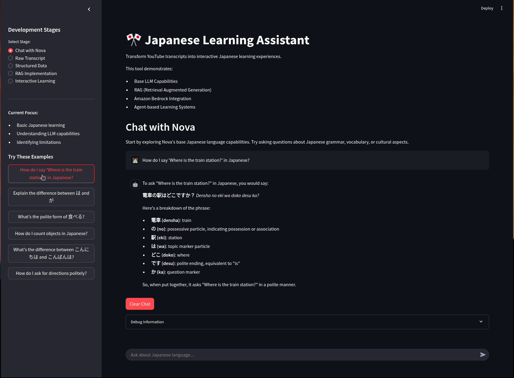

# Language Learning Assistant

<div align="center">
  
</div>

A web-based interactive language learning application that helps users learn Japanese through real-world content. The application processes Japanese language content from YouTube videos and uses AI to provide contextual learning assistance.

## Features

- Process Japanese language content from YouTube videos
- Interactive Q&A about the content using AI
- Contextual understanding of Japanese language patterns
- Real-time translations and explanations
- Support for Japanese learning through authentic materials
- Vector database for efficient content retrieval
- Multilingual embedding model support
- Advanced audio synthesis with Amazon Polly
- Intelligent caching system for faster responses
- User feedback collection system
- Interactive learning exercises with:
  - Vocabulary practice with word highlighting
  - Dialogue comprehension exercises
  - Real Japanese audio practice with native voices
  - Progress tracking and session statistics
  - Instant feedback and explanations

## Current Development Status

- ✅ YouTube transcript processing
- ✅ Japanese text preprocessing
- ✅ AI-powered Q&A system
- ✅ Context-aware responses
- ✅ Streamlit web interface
- ✅ Vector database integration
- ✅ Caching system
- ✅ Interactive learning implementation
  - Vocabulary quizzes
  - Dialogue comprehension
  - Native Japanese audio with Amazon Polly
  - Intelligent audio caching
- ⏳ Additional language support (Planned)
- ⏳ User progress tracking (Planned)

## Prerequisites

1. **System Requirements**
   - Python 3.8 or higher
   - pip package manager
   - At least 4GB RAM recommended for embedding models
   - Disk space for storing transcripts and embeddings

2. **Required Packages**
   - chromadb (Vector database for semantic search)
   - streamlit (Web interface)
   - boto3 (AWS SDK for Python)
   - youtube-transcript-api (YouTube transcript processing)
   - sentence-transformers (Text embedding model)

3. **AWS Services Setup**
   - Active AWS Account
   - IAM User with appropriate permissions
   - Amazon Bedrock model access enabled
   - Amazon Polly access enabled
   - AWS credentials configured

## Installation

1. **Clone the Repository**
   ```sh
   git clone [repository-url]
   cd language-learning-assistant
   ```

2. **Set Up AWS Credentials**
   - Follow [AWS Bedrock Getting Started Guide](https://docs.aws.amazon.com/bedrock/latest/userguide/getting-started-api.html)
   - Configure AWS credentials using one of these methods:
     - Environment variables (AWS_ACCESS_KEY_ID and AWS_SECRET_ACCESS_KEY)
     - AWS credentials file (~/.aws/credentials)
     - IAM roles for AWS services

3. **Install Dependencies**
   ```sh
   cd backend
   pip install -r requirements.txt
   ```

## Running the Application

1. **Start the Backend**
   ```sh
   cd backend
   python main.py
   ```

2. **Launch the Frontend**
   ```sh
   streamlit run frontend/main.py
   ```
   The application will open in your default web browser.

## Usage

1. Input a YouTube URL containing Japanese content
2. Wait for the system to process the transcript
3. Ask questions about the content in English
4. Receive detailed explanations with Japanese examples and translations
5. Practice with interactive exercises:
   - Study vocabulary in context with visual highlighting
   - Practice dialogue comprehension with structured conversations
   - Improve listening skills with native Japanese voices
   - Track your progress with session statistics

## Usage Examples

1. **Learning from Dialogues**
   - Input a Japanese learning video URL
   - Ask questions about vocabulary and grammar
   - Get explanations with real context

2. **Pattern Recognition**
   - System highlights common language patterns
   - Provides usage examples from the content
   - Shows cultural context when relevant

3. **Practice Assistance**
   - Use real-world examples for learning
   - Get instant feedback on understanding
   - Review content with different perspectives

4. **Interactive Learning**
   - Practice vocabulary with visual word highlighting
   - Test comprehension with dialogue exercises
   - Listen to native Japanese speakers with Amazon Polly voices
   - Choose from multiple voice options for varied practice
   - Track learning progress with accuracy metrics
   - Review practice history and performance

## Support

For issues and feature requests, please open an issue in the repository.

## License

This project is licensed under the terms of the LICENSE file included in the repository.

