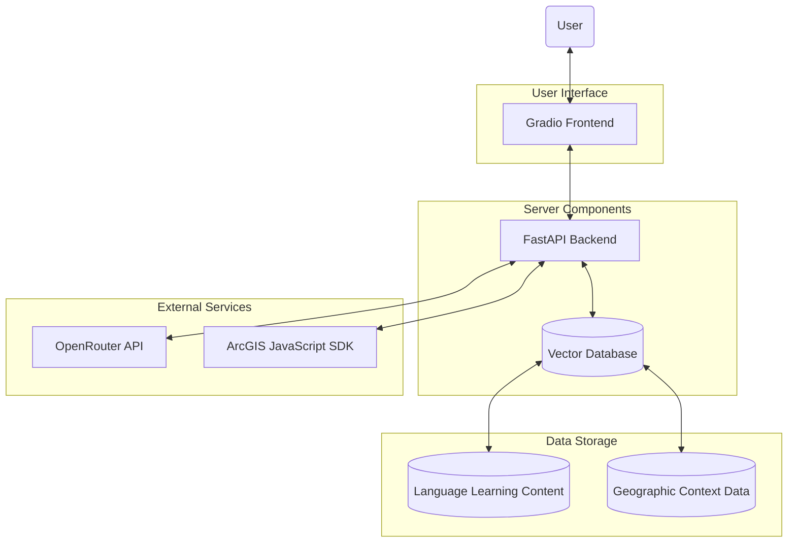

# Language Voyager: Geo-Immersive Language Learning

**Concept:** A game where players "travel" through a country or region using ArcGIS maps to learn the local language through location-specific vocabulary, cultural contexts, and interactive conversations.

## Core Gameplay

Players navigate a detailed ArcGIS map of their target language's country (e.g., Japan for Japanese learners). As they explore, they encounter:

1. **Location-based vocabulary challenges** - Learn words relevant to specific locations
2. **Conversation simulations** with virtual locals using the LLM
3. **Cultural missions** that combine language learning with cultural knowledge
4. **Progressive difficulty** as players "unlock" new regions

## Technical Architecture



## Technical Stack Details

1. **Frontend: Gradio**
    - Interactive UI with map visualization and chat interface
    - WebGL support for smooth map rendering
    - Responsive design for desktop/mobile play
2. **Backend: FastAPI**
    - Handles user authentication and progress tracking
    - Manages communication between components
    - Processes language learning content
3. **ArcGIS Integration**
    - ArcGIS JavaScript SDK for interactive maps
    - Custom layers for game elements (POIs, missions, progress)
    - Geofencing for location-based challenges
4. **LLM via OpenRouter API**
    - Conversation simulations with context-aware prompting
    - Difficulty adaptation based on user level
    - Cultural and linguistic feedback
5. **Vector Database (FAISS or Chroma)**
    - Stores language content embeddings
    - Enables semantic search for relevant vocabulary
    - Maintains cultural information tied to locations
6. **Additional Components**
    - Redis for session management
    - PostgreSQL for user profiles and progress
    - AWS S3 or similar for storing audio pronunciations
    - WebSockets for real-time interactions

## Core Features

### 1. Geographic Exploration

- Players use the ArcGIS map to navigate virtual Japan (or target country)
- Detailed 3D buildings and landmarks in major cities
- "Fog of war" revealing new areas as progress is made

### 2. Contextual Language Learning

- Vocabulary tied to location types (train stations, restaurants, parks)
- Phrases useful for specific contexts (ordering food, asking directions)
- Cultural notes embedded in map locations

### 3. AI-Powered Interactions

- LLM creates virtual locals with different personalities and speech patterns
- Conversation simulations adapt to player's proficiency
- Role-playing scenarios (ordering food, asking for directions)

### 4. Progression System

- "Language passport" tracking mastered vocabulary and grammar
- Unlockable regions requiring specific language skills
- Achievements for cultural knowledge and language milestones

### 5. Multiplayer Elements

- Optional cooperative challenges with other learners
- Language exchange matching with native speakers
- Shared goals for community exploration

## Implementation Considerations

1. **Prompt Engineering**
    - Design templates for the LLM that maintain character consistency
    - Include geographic and cultural context in each prompt
    - Adjust language complexity based on user level
2. **ArcGIS Optimization**
    - Use vector tile layers for performance
    - Implement level-of-detail controls for smooth mobile experience
    - Cache frequently visited areas
3. **Content Management**
    - Pipeline for adding new regions and language content
    - Cultural review to ensure authentic representation
    - Regular updates with new challenges and scenarios

# ArcGIS Integration in Language Voyager

ArcGIS mapping is not just a visual backdrop but a fundamental gameplay mechanism in Language Voyager. Here's how the mapping system becomes intrinsic to the language learning experience:

## Map-Driven Game Logic

### 1. Geographic Context Engine

The game uses ArcGIS layers to create a semantic understanding of locations:

- **POI Classification System**: ArcGIS data classifies locations (restaurants, train stations, parks, etc.) which directly determines vocabulary sets presented to the user
- **Urban vs. Rural Detection**: The game automatically adjusts language difficulty and dialect based on population density data
- **Elevation and Terrain Analysis**: Triggers appropriate nature vocabulary in mountainous regions versus coastal areas

### 2. Cultural Zones and Language Variation

- **Regional Dialect Mapping**: ArcGIS boundaries define where dialectal variations appear in conversations
- **Historical Data Integration**: Older neighborhoods trigger traditional language forms and cultural references
- **Demographic Data Utilization**: Areas with different age distributions present language appropriate to those demographics (youth slang in university districts)

### 3. Distance-Based Progression

- **Travel Mechanics**: Players must "travel" realistic distances on the map, with language difficulty increasing with distance from starting point
- **Transportation Networks**: Using train lines, roads and other transportation features to gate progress until specific vocabulary is mastered
- **Border Crossings**: Natural features like rivers or mountains serve as skill checkpoints requiring specific grammar or vocabulary mastery

## Technical Implementation of Map-Based Logic

```python
# Pseudocode for map-based language content selection
def determine_language_content(user_position, user_proficiency):
    # Query ArcGIS for location details
    location_data = arcgis_service.query_location(
        latitude=user_position.lat,
        longitude=user_position.lng
    )

    # Extract contextual information
    location_type = location_data.get_primary_classification()  # e.g., "restaurant", "train_station"
    region = location_data.get_administrative_region()  # e.g., "Kansai", "Tohoku"
    urban_density = location_data.get_population_density()  # e.g., "urban", "rural"

    # Select appropriate language content
    vocabulary_set = vector_db.query(
        context=location_type,
        region=region,
        difficulty=user_proficiency
    )

    # Adjust conversation style based on location
    dialect_settings = dialect_rules.get(region, "standard")
    formality_level = determine_formality(location_type, urban_density)

    return {
        "vocabulary": vocabulary_set,
        "dialect": dialect_settings,
        "formality": formality_level,
        "cultural_notes": get_cultural_context(location_data)
    }

```

## Core Map Integration Features

### 1. Interactive Layer System

- **Base Topographic Layer**: Provides geographic context and realistic navigation
- **POI Layer**: Points of interest with attached language challenges
- **Progress Layer**: Visual indicators of completed challenges and mastered areas
- **Custom Game Layer**: Shows missions, collectibles, and other game elements

### 2. Spatial Relationship Logic

The game constantly evaluates the player's position relative to other map elements:

- **Proximity Triggers**: As players approach specific features (temples, markets), relevant language modules activate
- **View Analysis**: What the player can "see" from their position affects conversation topics
- **Path Planning**: The system suggests linguistic challenges based on optimal routes between locations

### 3. Geofencing Mechanics

- **Language Immersion Zones**: Defined areas where only the target language is used
- **Difficulty Boundaries**: Geographic regions with progressively challenging language content
- **Time-Limited Challenges**: Location-specific tasks that must be completed within a certain timeframe

### 4. Dynamic Weather and Time Integration

- **Real-time Weather API**: Vocabulary related to current weather conditions at the virtual location
- **Day/Night Cycle**: Time-appropriate phrases and activities based on local time in the target country
- **Seasonal Content**: Language related to seasonal events and traditions when applicable

## Implementation Example: Tokyo Station Scenario

When a player navigates to Tokyo Station in the game:

1. **ArcGIS identifies**: Major transportation hub, shopping area, business district
2. **System activates**: Train vocabulary, shopping phrases, formal business Japanese
3. **LLM receives context**: "User is at Tokyo Station, intermediate level, rush hour time"
4. **Map displays**: Interactive train departures board, directional signage in Japanese, crowded platform visuals
5. **Challenge triggers**: "Navigate to Yamanote Line platform using only Japanese directions"

The ArcGIS mapping doesn't just show where the player is—it actively shapes what they learn, how they learn it, and creates an authentic context that makes language acquisition more natural and memorable.

```mermaid
flowchart TD
    Start([Game Start]) --> UserConfig[User Selects Target Language & Proficiency Level]
    UserConfig --> InitMap[Initialize ArcGIS Map with Starting Location]
    InitMap --> PlayerPosition[Update Player Position on Map]

    PlayerPosition --> LocationAnalysis{Location Analysis}

    LocationAnalysis --> GeoFeatures[Extract Geographic Features]
    LocationAnalysis --> POIDetection[Identify Nearby POIs]
    LocationAnalysis --> RegionIdentify[Determine Administrative Region]
    LocationAnalysis --> UrbanAnalysis[Calculate Urban Density]

    GeoFeatures --> ContextBuilder[Build Location Context]
    POIDetection --> ContextBuilder
    RegionIdentify --> ContextBuilder
    UrbanAnalysis --> ContextBuilder

    ContextBuilder --> ContentSelection[Select Language Content]

    ContentSelection --> VocabQuery[Query Vocabulary Database]
    ContentSelection --> DialectSettings[Apply Regional Dialect Rules]
    ContentSelection --> FormalityLevel[Determine Formality Level]
    ContentSelection --> CulturalNotes[Retrieve Cultural Context]

    VocabQuery --> ContentPackage[Assemble Content Package]
    DialectSettings --> ContentPackage
    FormalityLevel --> ContentPackage
    CulturalNotes --> ContentPackage

    ContentPackage --> DifficultyAdjust[Adjust for User Proficiency]
    DifficultyAdjust --> LLMPrompt[Generate LLM Context & Prompt]

    LLMPrompt --> InteractionType{Determine Interaction Type}

    InteractionType --> Conversation[Simulate Conversation]
    InteractionType --> Challenge[Language Challenge]
    InteractionType --> CulturalLesson[Cultural Lesson]

    Conversation --> LLMResponse[Process LLM Response]
    Challenge --> UserAttempt[User Attempts Challenge]
    CulturalLesson --> InfoDisplay[Display Cultural Information]

    LLMResponse --> UserInteraction[User Interaction]
    UserAttempt --> ChallengeEvaluation[Evaluate User Response]
    InfoDisplay --> QuizSetup[Set Up Knowledge Quiz]

    UserInteraction --> ProgressUpdate[Update User Progress]
    ChallengeEvaluation --> ProgressUpdate
    QuizSetup --> UserQuizAttempt[User Takes Quiz]
    UserQuizAttempt --> QuizEvaluation[Evaluate Quiz Results]
    QuizEvaluation --> ProgressUpdate

    ProgressUpdate --> UnlockCheck{Check for Unlocks}
    UnlockCheck -->|Yes| UnlockNewArea[Unlock New Map Areas]
    UnlockCheck -->|No| ProgressStorage[Store Progress]
    UnlockNewArea --> ProgressStorage

    ProgressStorage --> UserMovement{User Movement?}
    UserMovement -->|Yes| PlayerPosition
    UserMovement -->|No| ProximityCheck{Check Proximity Triggers}

    ProximityCheck -->|Triggered| NewPOIAlert[Alert User to New Opportunity]
    ProximityCheck -->|None| WaitState[Wait for User Action]

    NewPOIAlert --> WaitState
    WaitState --> UserAction{User Action}
    UserAction -->|Move| PlayerPosition
    UserAction -->|Interact| InteractionType
    UserAction -->|Exit| End([End Session])

    subgraph "Geographic Context Processing"
        LocationAnalysis
        GeoFeatures
        POIDetection
        RegionIdentify
        UrbanAnalysis
        ContextBuilder
    end

    subgraph "Language Content Generation"
        ContentSelection
        VocabQuery
        DialectSettings
        FormalityLevel
        CulturalNotes
        ContentPackage
        DifficultyAdjust
        LLMPrompt
    end

    subgraph "User Engagement Loop"
        InteractionType
        Conversation
        Challenge
        CulturalLesson
        LLMResponse
        UserAttempt
        InfoDisplay
        UserInteraction
        ChallengeEvaluation
        QuizSetup
        UserQuizAttempt
        QuizEvaluation
    end

    subgraph "Progress & Map Evolution"
        ProgressUpdate
        UnlockCheck
        UnlockNewArea
        ProgressStorage
        UserMovement
        ProximityCheck
        NewPOIAlert
        WaitState
        UserAction
    end

```



## Key Logic Paths Explained

This flowchart illustrates the complete logic flow of the Language Voyager game. Here are the main components:

### Initial Setup & Geographic Context

1. **User Configuration**: Player selects target language and proficiency level
2. **Map Initialization**: ArcGIS map loads with appropriate starting location
3. **Geographic Analysis**: When a player moves to a position, the system:
    - Extracts physical features (mountains, water bodies, etc.)
    - Identifies nearby points of interest
    - Determines the administrative region (affecting dialect)
    - Calculates urban density (affecting language formality)

### Content Generation

1. **Context Building**: All geographic data forms a location context
2. **Content Selection**: The system queries relevant:
    - Vocabulary sets
    - Dialect variations
    - Appropriate formality levels
    - Cultural information
3. **Difficulty Adaptation**: Content is adjusted based on user's proficiency
4. **LLM Prompting**: Context-rich prompts are generated for the language model

### User Interaction Loop

1. **Interaction Types**:
    - Conversational practice with virtual locals
    - Specific language challenges/tasks
    - Cultural lessons with knowledge assessment
2. **User Response Handling**: Evaluates user's language attempts
3. **Progress Tracking**: Updates mastery metrics across vocabulary, grammar, and cultural knowledge

### Map Progression System

1. **Unlock Mechanics**: Checks if user has met criteria to unlock new areas
2. **Proximity Triggers**: Detects when user approaches special locations
3. **Action Cycle**: Continuous loop of movement, interaction, and progression

### Technical Integration Points

- ArcGIS spatial queries drive content selection
- Vector database retrieves appropriate language materials
- LLM generates contextually appropriate conversations
- Player progress is continuously synchronized with map access

This comprehensive logic flow ensures that the geographic context directly shapes the language learning experience, making map interaction an integral part of the educational process rather than just a visual element.

**Feasibility Evaluation of Language Voyager: Geo-Immersive Language Learning**

The **Language Voyager** project presents an innovative approach to language learning through geospatial immersion, leveraging modern GIS and AI technologies. Below is a structured evaluation of its feasibility:

---

### **Strengths & Opportunities**

1. **Conceptual Innovation**
    - Combines language acquisition with cultural/geographic context, aligning with proven immersive learning methodologies.
    - Dynamic integration of location-based vocabulary and AI-driven conversations could enhance retention and engagement.
2. **Technical Foundation**
    - Well-architected stack using established tools (FastAPI, ArcGIS SDK, OpenRouter) minimizes reinvention.
    - Vector databases (FAISS/Chroma) enable efficient context-aware content delivery.
    - Modular design separates concerns (UI, backend, services), aiding scalability.
3. **Market Potential**
    - Targets both language learners and geography/culture enthusiasts.
    - Multiplayer and community features could foster a sticky user base.

---

### **Challenges & Risks**

1. **Technical Complexity**
    - **GIS Integration**: Real-time geofencing, 3D rendering, and dynamic content loading (especially on mobile) may strain performance.
    - **LLM Reliance**: Context-aware prompting for diverse dialects/formality levels risks inconsistent outputs. Latency from OpenRouter API could disrupt UX.
    - **Data Overhead**: Curating and maintaining geographically tagged language/cultural content at scale is resource-intensive.
2. **Content Development**
    - Requires collaboration with linguists and cultural experts to ensure accuracy, especially for regional dialects and etiquette.
    - Regular updates (new regions, challenges) are needed to retain users, demanding ongoing investment.
3. **User Experience**
    - Balancing "gameplay" (e.g., progression, unlocks) with educational outcomes risks diluting both.
    - Overloading users with location-triggered content could cause cognitive fatigue.
4. **Monetization & Scaling**
    - No clear revenue model outlined (e.g., subscriptions, in-app purchases for regions).
    - Hosting high-resolution maps and AI interactions may incur significant cloud costs.

---

### **Critical Feasibility Factors**

1. **Team Expertise**
    
    Requires cross-disciplinary skills:
    
    - GIS development (ArcGIS SDK, spatial analytics)
    - NLP/LLM integration (prompt engineering, response validation)
    - Game design (progression systems, UI/UX)
    - Localization (cultural/linguistic accuracy).
2. **Data Pipeline**
    - Automating content generation (e.g., linking vocabulary to POIs) while maintaining quality.
    - Validating LLM outputs for cultural sensitivity and grammatical accuracy.
3. **Performance Optimization**
    - Caching strategies for map tiles and language content.
    - Load testing AI conversations and real-time multiplayer features.
4. **Regulatory Compliance**
    - Privacy laws (GDPR/CCPA) for geolocation data and user profiles.
    - Content moderation in community features.

---

### **Recommendations**

1. **MVP Approach**
    
    Start with a single region (e.g., Tokyo) and basic interactions (directions, food ordering). Validate core tech (GIS + LLM) before scaling.
    
2. **Hybrid Content Strategy**
    - Use AI to generate draft content, but rely on human experts for validation.
    - Partner with cultural organizations for authentic regional data.
3. **Progressive Feature Rollout**
    
    Prioritize:
    
    - Core map interactions + vocabulary
    - LLM conversations
    - Multiplayer features (post-launch).
4. **Performance Mitigations**
    - Use CDNs for static map assets.
    - Edge computing for AI responses.
    - Offline mode for basic challenges.
5. **Monetization Models**
    - Freemium: Free base regions, paid expansions (e.g., "Unlock Kansai Dialect Pack").
    - Institutional licensing (schools, corporate training).

---

### **Conclusion**

**Feasibility Rating: Moderate-High**

The project is technically achievable with existing tools but requires significant investment in content curation, performance tuning, and iterative UX testing. Success hinges on balancing educational rigor with engaging gameplay and securing partnerships for cultural/localization support. A phased rollout focusing on a single language/region would mitigate initial risks.