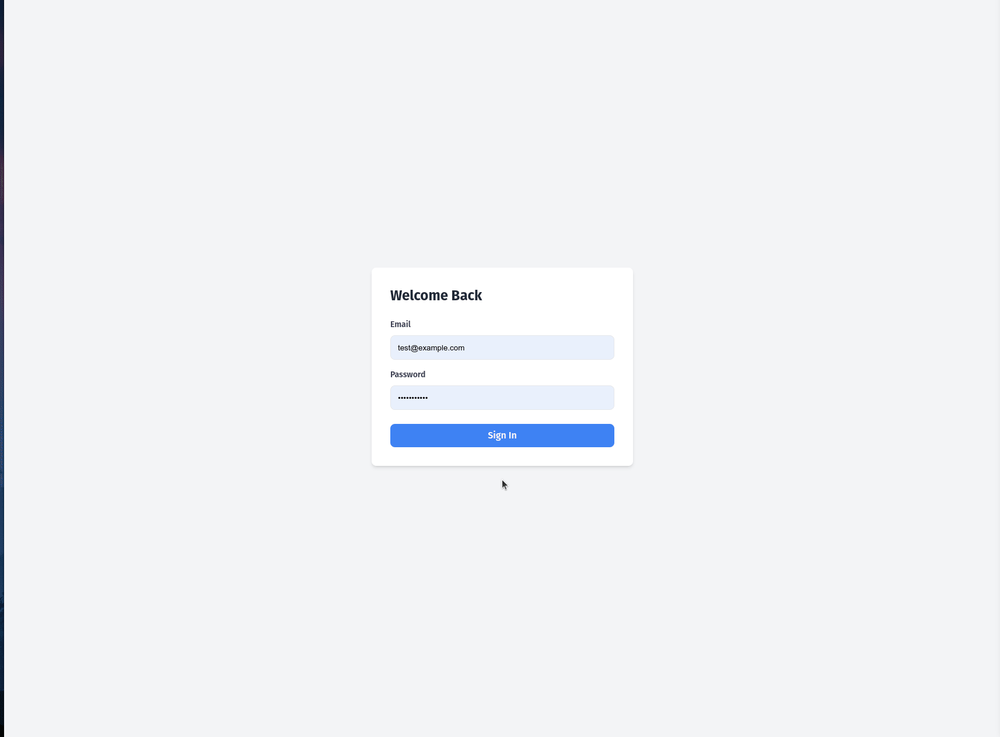
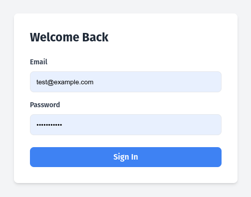
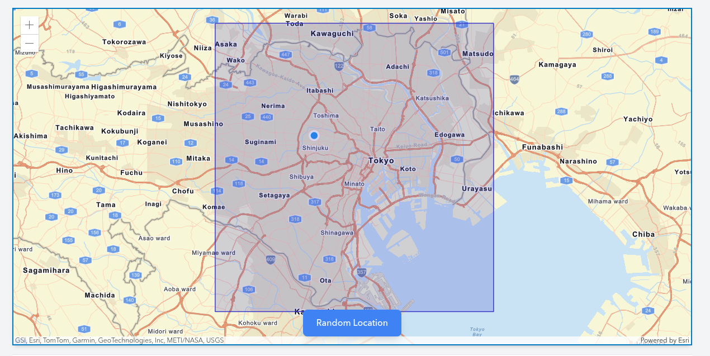
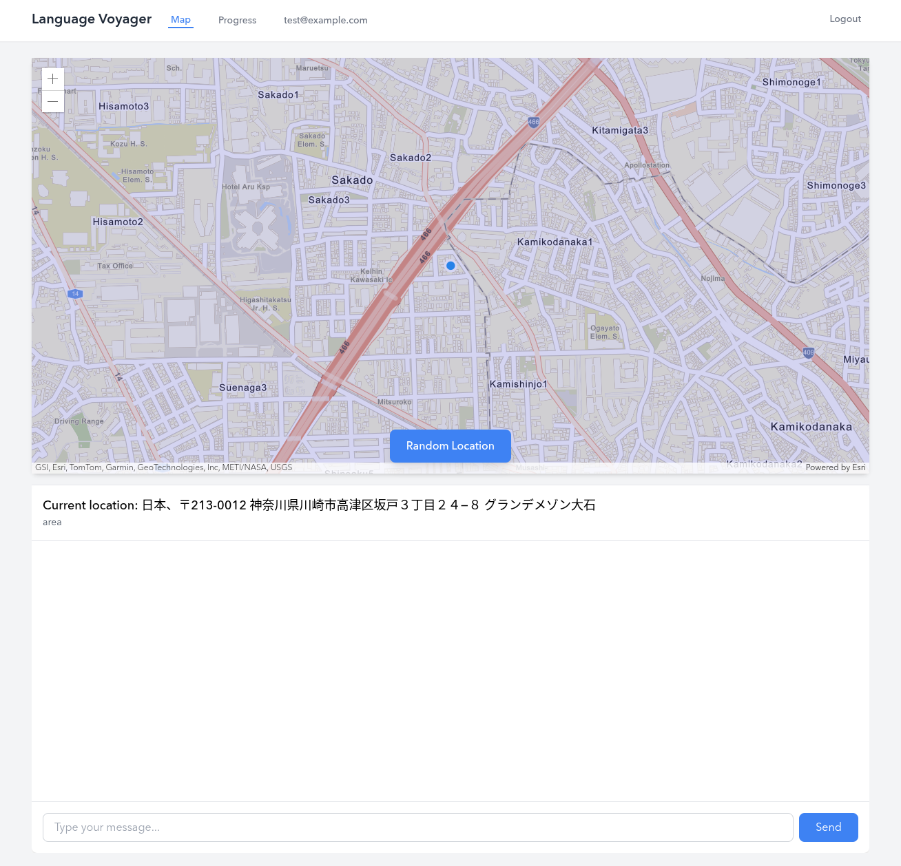
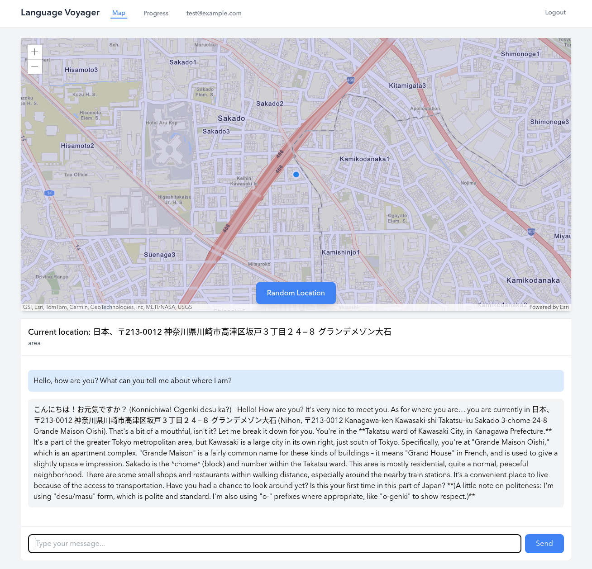
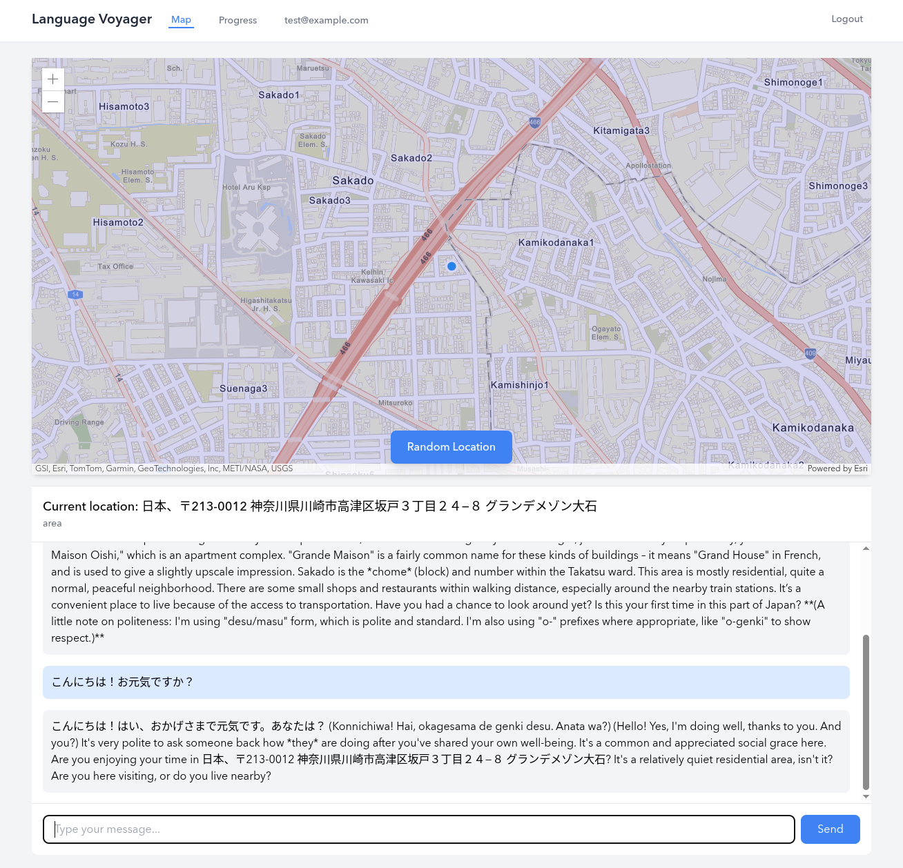
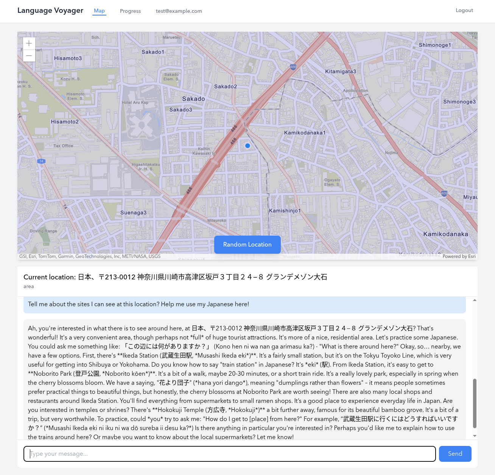
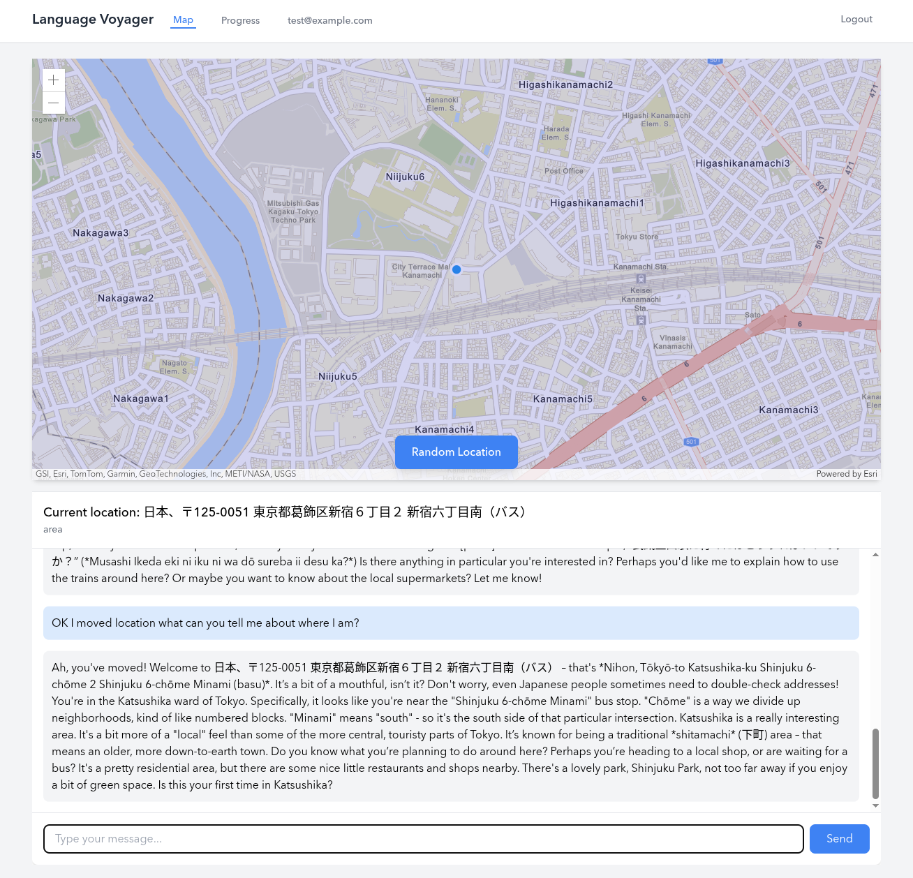

# Language Voyager: Geo-Immersive Language Learning



**Concept:** A game where players "travel" through a country or region using ArcGIS maps to learn the local language through location-specific vocabulary, cultural contexts, and interactive conversations.

## Current Implementation Status

The project currently has:
- ✅ Full-featured backend with FastAPI
- ✅ Basic frontend with login functionality
- ✅ Tokyo region mapping with bounded exploration
- ✅ Random user placement within Tokyo
- ✅ Random Location button functionality
- ✅ Location-aware chat system with LLM integration
- ✅ Real-time location updates

Features marked with ⏳ in this document are planned for future implementation.

## Core Gameplay

Players navigate a detailed ArcGIS map of their target language's country (e.g., Japan for Japanese learners). As they explore, they encounter:

1. **Location-based vocabulary challenges** - Learn words relevant to specific locations
2. **Conversation simulations** with virtual locals using the LLM
3. **Cultural missions** that combine language learning with cultural knowledge
4. **Progressive difficulty** as players "unlock" new regions

## Technical Documentation

For a comprehensive technical appraisal of the project, including:
- Detailed system architecture and data flows
- API schemas and endpoint documentation
- Database models and relationships
- Implementation considerations and feasibility analysis
- Service integration details and limitations

Please refer to [technical_details.md](technical_details.md).

## Getting Started

### Prerequisites
- Docker and Docker Compose
- Python 3.10 or higher (for local development only)
- Node.js 16 or higher with npm (for frontend development and building)

### Setup Instructions

1. Clone the repository:
   ```bash
   git clone <repository-url>
   cd language-voyager
   ```

2. Create and configure environment variables:
   ```bash
   cp .env.example .env
   ```
   
   Configure your API keys in the .env file:
   ```
   ARCGISARCGIS_API_KEY  # Must be enclosed in quotes ("")
   OPENROUTER_API_KEY
   GOOGLE_PLACES_API_KEY
   ```

   **IMPORTANT!:** The ARCGISARCGIS_API_KEY must be enclosed in quotes, while the other keys do not require quotes.

   ### API Key Setup Instructions (see API Quotas/Requests per month section for details on API limits with these free tiers):

    ArcGIS API Key
      - Go to [ArcGIS API Key Creation](https://developers.arcgis.com/documentation/security-and-authentication/api-key-authentication/tutorials/create-an-api-key/)
      - Follow the 3-step guide under "Create an API key credential"
      - Select "ArcGIS Location Services" platform tab
      - This key provides the rendered mapping for the project
   
    OpenRouter API Key
      - Go to [OpenRouter Keys](https://openrouter.ai/settings/keys)
      - Create an account and generate an API key
      - Free access to LLM models included
      - Default model: google/gemma-3-27b-it:free
      - Other models available (may require credits)
   
   Google Places API Key
      - Go to [Google Places API](https://developers.google.com/maps/documentation/places/web-service/get-api-key)
      - Used for Japanese location naming
      - Offers more generous location resolving credits than ArcGIS


3. Build and start the containers (see Container Structure section below for examples of running containers):
   ```bash
   docker compose build
   docker compose up -d
   ```

4. Verify the setup:
   - Open `http://localhost:8000/health` in your browser
   - Expected response:
     ```json
     {
         "status": "online",
         "database": "healthy",
         "arcgis": "healthy",
         "version": "api/v1"
     }
     ```

5. Build the frontend:
   ```bash
   cd frontend
   npm install
   npm run build
   ```

6. Access the application (see Application Demo Screens section for expected application flow):
   - Go to `http://localhost:8000`
   - Use the test credentials:
     ```
     Email: test@example.com
     Password: testpass123
     ```
   Note: These credentials are temporary and will be removed once user creation is implemented.

### Development API Documentation

When running in development mode (this is the current default set in the .env file), you can access the API documentation and view all the endpoints and schemas at:

1. **SwaggerUI**
   - URL: `http://localhost:8000/api/docs`
   - Interactive API documentation and testing

2. **ReDoc**
   - URL: `http://localhost:8000/api/redoc`
   - Detailed API schema and reference

## Container Structure

The application uses Docker health checks to ensure services are properly initialized:
- Database: PostgreSQL database service with health checks
- Cache: Redis cache service with health checks  
- Web API: FastAPI service that waits for dependent services

You can monitor container health & status using:
```bash
docker compose ps
```

Example output:
```
NAME                       IMAGE                  COMMAND                  SERVICE   CREATED      STATUS                   PORTS
language-voyager-db-1      postgres:15            "docker-entrypoint.s…"   db        3 days ago   Up 2 minutes (healthy)   5432/tcp
language-voyager-redis-1   redis:7                "docker-entrypoint.s…"   redis     3 days ago   Up 2 minutes (healthy)   0.0.0.0:6379->6379/tcp
language-voyager-web-1     language-voyager-web   "uvicorn app.main:ap…"   web       2 days ago   Up 2 minutes             0.0.0.0:8000->8000/tcp
```

## Application Demo screens

1. Here is the initial login screen using the test credentials provided above



2. The random locations are bounded within the Tokyo region, so the blue rectangle shown on the zoomed out map example below 




3. Once you login you will see the Map screen and Chat container screen, you will be presented with a random location



4. Now you can ask the LLM a question. The LLM is aware of the current location displayed at the top of the chat container, and it can reply to you with context aware responses based on the current location.



5. Here is a follow up question



6. If you use Japanese in your reply, the LLM should reply back with more examples in Japanese. You can use Hirigana, Kanji, Katakana and Romanji to converse with the LLM and it can respond back with examples using these writing systems and again the responses are location aware. 




7. To change random location click on the blue Random Location button at the bottom center of the map



8. Lastly there are water features on the map, ocean and rivers. You can for example be located over a body of water and you can ask the LLM a location aware question 


## API Quotas/Requests per month

### ArcGIS Location Services Limits

The application uses ArcGIS Location Services with the following free tier limits:

| Service | Description | Monthly Free Limit | Overage Rate |
|---------|-------------|-------------------|--------------|
| Basemap Tiles | Vector, map, and static basemap tiles | 2,000,000 | $0.15 per 1,000 tiles |
| Nearby Search | Filter and obtain data points (lat/long, attributes) | 500 | $8 per 1,000 requests |
| Place Attributes | Description, contact, social, rating info | 100 | $0.05 per 1,000 places |
| Address Attributes | Location and delivery information | 100 | $0.10 per 1,000 places |
| Details Attributes | Description, contact, social, rating info | 100 | $0.13 per 1,000 places |
| Location Attributes | Location coordinates (drop off, front door, etc.) | 100 | $0.35 per 1,000 places |

### Google Places API Limits

The application uses Google Places API with the following quotas:

| Service | Daily Limit | Per Minute Limit |
|---------|------------|------------------|
| Autocomplete Places | 175,000 | 12,000 |
| Get Photo Media | 175,000 | 600 |
| Get Place | 125,000 | 600 |
| Lookup Place Details | Unlimited | 600 |
| Search Nearby | 75,000 | 600 |
| Search Text | 75,000 | 600 |

Note: All services have unlimited per-user quotas. The limits above are service-wide quotas.

### OpenRouter API Limits

The application uses OpenRouter API with the following limits:

| Tier | Request Limits |
|------|----------------|
| Free Models (:free suffix) | • 20 requests per minute<br>• 200 requests per day |
| Paid Models | • 1 request per credit per second<br>• Maximum 500 requests per second (higher limits available on request) |

Rate limits are based on credits remaining:
- 0.5 credits → 1 request/second (minimum)
- 5 credits → 5 requests/second
- 10 credits → 10 requests/second
- 500 credits → 500 requests/second
- 1000+ credits → Contact OpenRouter for higher limits

Note: The application uses the free model `google/gemma-3-27b-it:free`, so the free tier limits apply. A negative credit balance may result in 402 errors, even for free models.


## Technical Architecture


## Technical Stack Details

1. **Frontend: React**
    - Interactive UI with map visualization and chat interface
    - WebGL support for smooth map rendering
    - Responsive design for desktop/mobile play
2. **Backend: FastAPI**
    - Handles user authentication and progress tracking
    - Manages communication between components
    - Processes language learning content
3. **ArcGIS Integration**
    - ArcGIS JavaScript SDK for interactive maps
    - Custom layers for game elements (POIs, missions, progress)
    - Geofencing for location-based challenges
4. **LLM via OpenRouter API**
    - Conversation simulations with context-aware prompting
    - Difficulty adaptation based on user level
    - Cultural and linguistic feedback
5. **Vector Database (FAISS or Chroma)**
    - Stores language content embeddings
    - Enables semantic search for relevant vocabulary
    - Maintains cultural information tied to locations
6. **Additional Components**
    - Redis for session management
    - PostgreSQL for user profiles and progress
    - AWS S3 or similar for storing audio pronunciations
    - WebSockets for real-time interactions

## Core Features

### 1. Geographic Exploration ✅
- ArcGIS map navigation within bounded Tokyo region
- Random placement within Tokyo bounds
- "Random Location" button for quick movement

### 2. Contextual Language Learning ⏳
- Location-aware conversations with the LLM
- Cultural notes for specific areas (planned)
- Region-specific vocabulary sets (planned)

### 3. AI-Powered Interactions ✅
- Location-aware LLM conversations
- Dynamic conversation context based on current position
- Appropriate formality levels based on location type

### 4. Progression System ⏳
- Region-based achievement system (planned)
- Unlockable areas based on language proficiency (planned)
- Progress tracking and statistics (planned)

### 5. Multiplayer Elements ⏳
- Cooperative challenges with other learners (planned)
- Language exchange matching (planned)
- Shared exploration goals (planned)

## Implementation Considerations

1. **Prompt Engineering**
    - Design templates for the LLM that maintain character consistency
    - Include geographic and cultural context in each prompt
    - Adjust language complexity based on user level
2. **ArcGIS Optimization**
    - Use vector tile layers for performance
    - Implement level-of-detail controls for smooth mobile experience
    - Cache frequently visited areas
3. **Content Management**
    - Pipeline for adding new regions and language content
    - Cultural review to ensure authentic representation
    - Regular updates with new challenges and scenarios

# ArcGIS Integration in Language Voyager

## Current Implementation Status

The following features are currently implemented:
- ✅ Basic map visualization with ArcGIS JavaScript SDK
- ✅ Tokyo region boundary with geofencing
- ✅ Random location placement within bounds
- ✅ Real-time location updates
- ✅ Location-aware LLM conversations
- ✅ Basic POI interaction system

### Tokyo Region Configuration
```javascript
// Current bounds configuration
TOKYO_BOUNDS = {
    north: 35.8187,
    south: 35.5311,
    east: 139.9224,
    west: 139.5804
}

// Center point
TOKYO_CENTER = {
    latitude: 35.6762,
    longitude: 139.6503
}
```

### LLM Integration Features
- Location-aware conversation context (see [System Prompt Structure](technical_details.md#system-prompt-structure))
- Dynamic formality adjustment based on location type
- Support for both Japanese and English place names
- Real-time location updates in chat context

Future planned features:
- ⏳ Multiple region support
- ⏳ Advanced POI interaction system
- ⏳ Cultural context integration
- ⏳ Region-specific achievements
- ⏳ Offline map support

## Current LLM Conversation Features

The chat system is currently implemented with the following features:

### Location Awareness
- Real-time location context updates when moving
- Both Japanese (local_name) and English place names included
- Location type detection (area, street, building, etc.)
- Formality adjustment based on location context

### Chat Interface
- Connected to OpenRouter API (google/gemma-3-27b-it:free model)
- Real-time location updates during conversation
- Maintains conversation history within session
- Simple text-based interaction

### Language Learning Rules
The LLM follows these core rules:
- Maintains appropriate formality based on location type
- Acts as a native Japanese speaker
- Provides gentle correction of language errors
- Includes cultural context when relevant
- Keeps conversations natural and location-appropriate

### Example Usage
1. Log in using the test credentials provided above
2. Navigate to any location in Tokyo using the map
3. Use the "Random Location" button to explore different areas
4. The chat system will maintain awareness of your current location
5. Ask questions about your surroundings or practice conversations

Note: Additional features like achievements, progress tracking, and region unlocking will be implemented in future updates.

## Map-Driven Game Logic

### 1. Geographic Context Engine

The game uses ArcGIS layers to create a semantic understanding of locations:

- **POI Classification System**: ArcGIS data classifies locations (restaurants, train stations, parks, etc.) which directly determines vocabulary sets presented to the user
- **Urban vs. Rural Detection**: The game automatically adjusts language difficulty and dialect based on population density data
- **Elevation and Terrain Analysis**: Triggers appropriate nature vocabulary in mountainous regions versus coastal areas

### 2. Cultural Zones and Language Variation

- **Regional Dialect Mapping**: ArcGIS boundaries define where dialectal variations appear in conversations
- **Historical Data Integration**: Older neighborhoods trigger traditional language forms and cultural references
- **Demographic Data Utilization**: Areas with different age distributions present language appropriate to those demographics (youth slang in university districts)

### 3. Distance-Based Progression

- **Travel Mechanics**: Players must "travel" realistic distances on the map, with language difficulty increasing with distance from starting point
- **Transportation Networks**: Using train lines, roads and other transportation features to gate progress until specific vocabulary is mastered
- **Border Crossings**: Natural features like rivers or mountains serve as skill checkpoints requiring specific grammar or vocabulary mastery

## Technical Implementation of Map-Based Logic

```python
# Pseudocode for map-based language content selection
def determine_language_content(user_position, user_proficiency):
    # Query ArcGIS for location details
    location_data = arcgis_service.query_location(
        latitude=user_position.lat,
        longitude=user_position.lng
    )

    # Extract contextual information
    location_type = location_data.get_primary_classification()  # e.g., "restaurant", "train_station"
    region = location_data.get_administrative_region()  # e.g., "Kansai", "Tohoku"
    urban_density = location_data.get_population_density()  # e.g., "urban", "rural"

    # Select appropriate language content
    vocabulary_set = vector_db.query(
        context=location_type,
        region=region,
        difficulty=user_proficiency
    )

    # Adjust conversation style based on location
    dialect_settings = dialect_rules.get(region, "standard")
    formality_level = determine_formality(location_type, urban_density)

    return {
        "vocabulary": vocabulary_set,
        "dialect": settings,
        "formality": formality_level,
        "cultural_notes": get_cultural_context(location_data)
    }

```

## Core Map Integration Features

### 1. Interactive Layer System

- **Base Topographic Layer**: Provides geographic context and realistic navigation
- **POI Layer**: Points of interest with attached language challenges
- **Progress Layer**: Visual indicators of completed challenges and mastered areas
- **Custom Game Layer**: Shows missions, collectibles, and other game elements

### 2. Spatial Relationship Logic

The game constantly evaluates the player's position relative to other map elements:

- **Proximity Triggers**: As players approach specific features (temples, markets), relevant language modules activate
- **View Analysis**: What the player can "see" from their position affects conversation topics
- **Path Planning**: The system suggests linguistic challenges based on optimal routes between locations

### 3. Geofencing Mechanics

- **Language Immersion Zones**: Defined areas where only the target language is used
- **Difficulty Boundaries**: Geographic regions with progressively challenging language content
- **Time-Limited Challenges**: Location-specific tasks that must be completed within a certain timeframe

### 4. Dynamic Weather and Time Integration

- **Real-time Weather API**: Vocabulary related to current weather conditions at the virtual location
- **Day/Night Cycle**: Time-appropriate phrases and activities based on local time in the target country
- **Seasonal Content**: Language related to seasonal events and traditions when applicable

## Implementation Example: Tokyo Station Scenario

When a player navigates to Tokyo Station in the game:

1. **ArcGIS identifies**: Major transportation hub, shopping area, business district
2. **System activates**: Train vocabulary, shopping phrases, formal business Japanese
3. **LLM receives context**: "User is at Tokyo Station, intermediate level, rush hour time"
4. **Map displays**: Interactive train departures board, directional signage in Japanese, crowded platform visuals
5. **Challenge triggers**: "Navigate to Yamanote Line platform using only Japanese directions"

The ArcGIS mapping doesn't just show where the player is—it actively shapes what they learn, how they learn it, and creates an authentic context that makes language acquisition more natural and memorable.


## Key Logic Paths Explained

This flowchart illustrates the complete logic flow of the Language Voyager game. Here are the main components:

### Initial Setup & Geographic Context

1. **User Configuration**: Player selects target language and proficiency level
2. **Map Initialization**: ArcGIS map loads with appropriate starting location
3. **Geographic Analysis**: When a player moves to a position, the system:
    - Extracts physical features (mountains, water bodies, etc.)
    - Identifies nearby points of interest
    - Determines the administrative region (affecting dialect)
    - Calculates urban density (affecting language formality)

### Content Generation

1. **Context Building**: All geographic data forms a location context
2. **Content Selection**: The system queries relevant:
    - Vocabulary sets
    - Dialect variations
    - Appropriate formality levels
    - Cultural information
3. **Difficulty Adaptation**: Content is adjusted based on user's proficiency
4. **LLM Prompting**: Context-rich prompts are generated for the language model

### User Interaction Loop

1. **Interaction Types**:
    - Conversational practice with virtual locals
    - Specific language challenges/tasks
    - Cultural lessons with knowledge assessment
2. **User Response Handling**: Evaluates user's language attempts
3. **Progress Tracking**: Updates mastery metrics across vocabulary, grammar, and cultural knowledge

### Map Progression System

1. **Unlock Mechanics**: Checks if user has met criteria to unlock new areas
2. **Proximity Triggers**: Detects when user approaches special locations
3. **Action Cycle**: Continuous loop of movement, interaction, and progression

### Technical Integration Points

- ArcGIS spatial queries drive content selection
- Vector database retrieves appropriate language materials
- LLM generates contextually appropriate conversations
- Player progress is continuously synchronized with map access

This comprehensive logic flow ensures that the geographic context directly shapes the language learning experience, making map interaction an integral part of the educational process rather than just a visual element.

--- 

**Feasibility Evaluation of Language Voyager: Geo-Immersive Language Learning**

The **Language Voyager** project presents an innovative approach to language learning through geospatial immersion, leveraging modern GIS and AI technologies. Below is a structured evaluation of its feasibility:

---

### **Strengths & Opportunities**

1. **Conceptual Innovation**
    - Combines language acquisition with cultural/geographic context, aligning with proven immersive learning methodologies.
    - Dynamic integration of location-based vocabulary and AI-driven conversations could enhance retention and engagement.
2. **Technical Foundation**
    - Well-architected stack using established tools (FastAPI, ArcGIS SDK, OpenRouter) minimizes reinvention.
    - Vector databases (FAISS/Chroma) enable efficient context-aware content delivery.
    - Modular design separates concerns (UI, backend, services), aiding scalability.
3. **Market Potential**
    - Targets both language learners and geography/culture enthusiasts.
    - Multiplayer and community features could foster a sticky user base.

---

### **Challenges & Risks**

1. **Technical Complexity**
    - **GIS Integration**: Real-time geofencing, 3D rendering, and dynamic content loading (especially on mobile) may strain performance.
    - **LLM Reliance**: Context-aware prompting for diverse dialects/formality levels risks inconsistent outputs. Latency from OpenRouter API could disrupt UX.
    - **Data Overhead**: Curating and maintaining geographically tagged language/cultural content at scale is resource-intensive.
2. **Content Development**
    - Requires collaboration with linguists and cultural experts to ensure accuracy, especially for regional dialects and etiquette.
    - Regular updates (new regions, challenges) are needed to retain users, demanding ongoing investment.
3. **User Experience**
    - Balancing "gameplay" (e.g., progression, unlocks) with educational outcomes risks diluting both.
    - Overloading users with location-triggered content could cause cognitive fatigue.
4. **Monetization & Scaling**
    - No clear revenue model outlined (e.g., subscriptions, in-app purchases for regions).
    - Hosting high-resolution maps and AI interactions may incur significant cloud costs.

---

### **Critical Feasibility Factors**

1. **Team Expertise**
    
    Requires cross-disciplinary skills:
    
    - GIS development (ArcGIS SDK, spatial analytics)
    - NLP/LLM integration (prompt engineering, response validation)
    - Game design (progression systems, UI/UX)
    - Localization (cultural/linguistic accuracy).
2. **Data Pipeline**
    - Automating content generation (e.g., linking vocabulary to POIs) while maintaining quality.
    - Validating LLM outputs for cultural sensitivity and grammatical accuracy.
3. **Performance Optimization**
    - Caching strategies for map tiles and language content.
    - Load testing AI conversations and real-time multiplayer features.
4. **Regulatory Compliance**
    - Privacy laws (GDPR/CCPA) for geolocation data and user profiles.
    - Content moderation in community features.

---

### **Recommendations**

1. **MVP Approach**
    
    Start with a single region (e.g., Tokyo) and basic interactions (directions, food ordering). Validate core tech (GIS + LLM) before scaling.
    
2. **Hybrid Content Strategy**
    - Use AI to generate draft content, but rely on human experts for validation.
    - Partner with cultural organizations for authentic regional data.
3. **Progressive Feature Rollout**
    
    Prioritize:
    
    - Core map interactions + vocabulary
    - LLM conversations
    - Multiplayer features (post-launch).
4. **Performance Mitigations**
    - Use CDNs for static map assets.
    - Edge computing for AI responses.
    - Offline mode for basic challenges.
5. **Monetization Models**
    - Freemium: Free base regions, paid expansions (e.g., "Unlock Kansai Dialect Pack").
    - Institutional licensing (schools, corporate training).

---

### **Conclusion**

**Feasibility Rating: Moderate-High**

The project is technically achievable with existing tools but requires significant investment in content curation, performance tuning, and iterative UX testing. Success hinges on balancing educational rigor with engaging gameplay and securing partnerships for cultural/localization support. A phased rollout focusing on a single language/region would mitigate initial risks.
