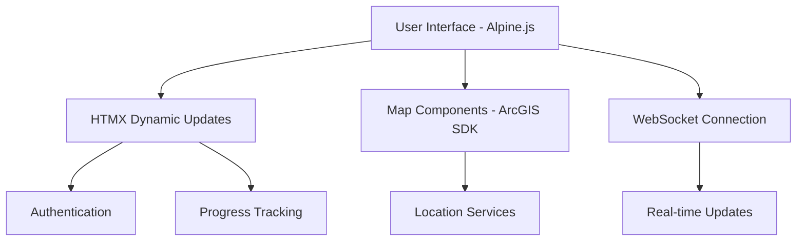
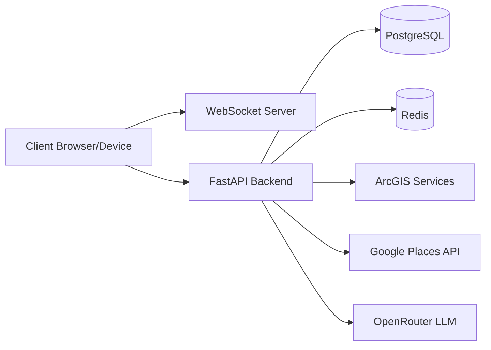
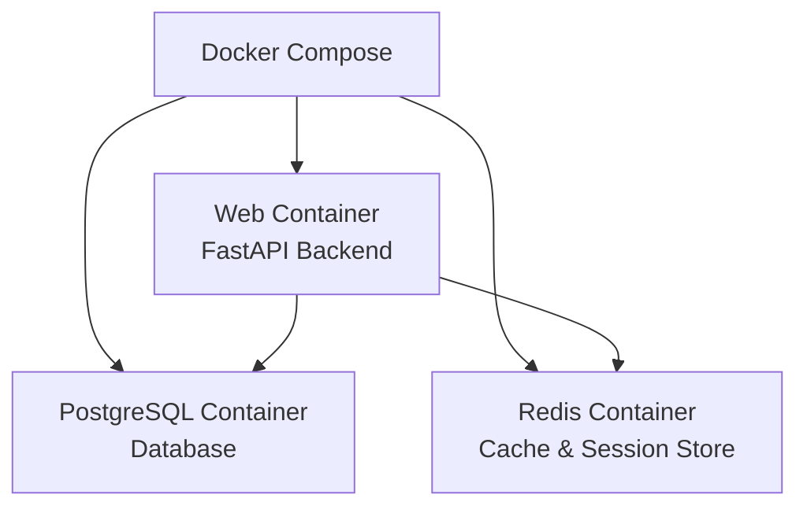
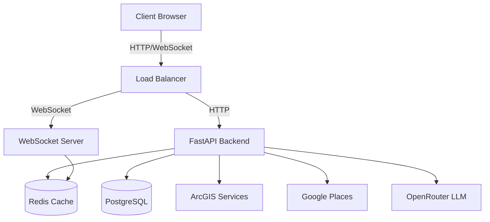
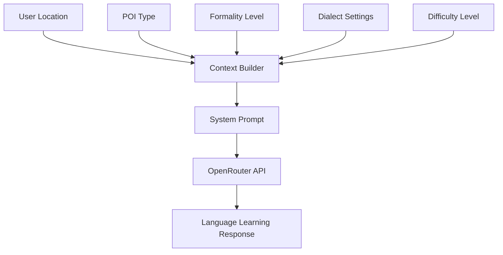

# Language Voyager Technical Documentation

## Technology Stack Overview

### Backend Technologies
- **Primary Language**: Python with FastAPI framework
- **Database**: PostgreSQL with SQLAlchemy ORM
- **Migration System**: Alembic
- **Caching**: Redis for session management and response caching
- **Real-time Communication**: WebSocket for location updates
- **Authentication**: JWT-based with OAuth2
- **Geographic Services**: 
  - ArcGIS for mapping and spatial calculations
  - Google Places API for Japanese location resolution
- **LLM Integration**: OpenRouter API for language assistance

### Frontend Technologies
- **Core UI**: Alpine.js and HTMX
- **Styling**: Tailwind CSS
- **Map Integration**: ArcGIS JavaScript SDK
- **Package Management**: npm/yarn
- **Build System**: Webpack
- **PWA Capabilities**: Service Workers for offline functionality

## Frontend Implementation

### Architecture


### Key Components
1. **Authentication System**
   - JWT token management
   - Protected route handling
   - Session persistence
   - Offline authentication support

2. **Map Integration**
   - ArcGIS JavaScript SDK integration
   - Real-time location tracking
   - POI visualization
   - Region boundary display
   - Offline map tile caching

3. **WebSocket Communication**
   - Real-time location updates
   - Connection state management
   - Automatic reconnection
   - Event handling for location changes

### Docker Configuration
- Frontend container with nginx
- Build-time optimization with webpack
- Development hot-reload support
- Static file serving
- WebSocket proxy configuration

## Backend Implementation

### System Architecture


### Core Components

1. **FastAPI Application**
   - RESTful API endpoints
   - WebSocket support
   - Authentication middleware
   - Request validation
   - Error handling
   - Response caching

2. **Database Layer**
   - SQLAlchemy models
   - Alembic migrations
   - Transaction management
   - Spatial data types
   - Query optimization

3. **Caching System**
   - Redis for session storage
   - Response caching
   - Real-time location tracking
   - Rate limiting

4. **Geographic Services**
   - ArcGIS integration for mapping
   - Google Places for Japanese locations
   - Geofencing
   - POI management
   - Spatial calculations

### Alembic Migration System
Alembic is used for:
- Database schema version control
- Incremental schema changes
- Data migrations
- Schema rollbacks
- Development/production sync

Migrations are run:
1. During initial setup
2. When deploying new features
3. When updating data structures
4. For data seeding operations

### Docker Infrastructure


## API Endpoints

### Authentication
- POST /auth/register - User registration
- POST /auth/token - Login
- GET /auth/me - Get user profile
- POST /auth/verify-email - Email verification
- POST /auth/reset-password - Password reset

### Map Integration
- GET /api/v1/map/regions - List available regions
- GET /api/v1/map/pois - Get points of interest
- GET /api/v1/map/location/details - Get location details
- WebSocket /api/v1/map/ws/location - Real-time location updates

### Progress Tracking
- GET /api/v1/progress - Get overall progress
- POST /api/v1/progress - Update progress
- GET /api/v1/progress/language/{lang} - Language-specific progress
- GET /api/v1/progress/region/{region} - Region-specific progress

### Content Management
- GET /api/v1/content/vocabulary - Get vocabulary
- GET /api/v1/content/phrases - Get phrases
- GET /api/v1/content/challenges - Get challenges
- POST /api/v1/content/challenges/{id}/attempt - Submit challenge attempt

## Data Flow Architecture



The system uses a microservices-inspired architecture while maintaining the simplicity of a monolithic application. This provides:
- Clear separation of concerns
- Scalable components
- Efficient real-time updates
- Robust data persistence
- Optimized caching
- Reliable LLM integration

## LLM Integration Details

### Language Learning Context Management

The system uses OpenRouter API with context-aware prompting to create an intelligent language learning assistant. Here's how the different components work together:

1. **Location-Aware Language Teaching**


2. **System Prompt Structure**
```
You are a native {dialect} speaker helping someone learn the language. 
Current location: {current_location.get('local_name', 'Unknown Location')}
Location type: {poi_type}
Speaking style: {formality}
Difficulty level: {difficulty}/100

Guidelines:
- When asked about the current location, use the Japanese name: {current_location.get('local_name')}
- Use appropriate formality for the location type
- Stay in character as a native speaker
- Maintain conversation difficulty around {difficulty}/100
- Use {dialect} dialect features when appropriate
- Natural conversations about this location type
- Correct major language errors gently
- Provide cultural context when relevant
```

3. **Context Parameters**
   - **POI Type**: Location category (temple, station, restaurant, etc.)
   - **Formality Level**: Adjusts language politeness based on location
   - **Dialect**: Regional language variations
   - **Difficulty**: Scale of 0-100 for language complexity
   - **Location Details**: Both Japanese and romanized names
   - **Custom Rules**: Location-specific cultural notes and customs

4. **Response Characteristics**
   - Culturally aware responses
   - Gentle error correction
   - Japanese-English code switching
   - Progressive difficulty scaling
   - Natural conversation flow
   - Location-specific vocabulary
   - Cultural context integration

### System Prompt Building

The system uses a sophisticated prompt building process in `app/services/openrouter.py` through the `_build_system_prompt` method. This method constructs context-aware prompts that guide the LLM's behavior:

1. **Context Parameters**
   ```python
   def _build_system_prompt(self, context: Dict) -> str:
       poi_type = context.get("poi_type", "location")
       formality = context.get("formality_level", "neutral")
       dialect = context.get("dialect", "standard")
       difficulty = context.get("difficulty_level", 50)
       current_location = context.get("current_location", {})
   ```

2. **Base Prompt Template**
   ```text
   You are a native {dialect} speaker helping someone learn the language. 
   Current location: {current_location.get('local_name', 'Unknown Location')}
   Location type: {poi_type}
   Speaking style: {formality}
   Difficulty level: {difficulty}/100

   Guidelines:
   - When asked about the current location, use the Japanese name: {current_location.get('local_name')}
   - Use appropriate formality for the location type
   - Stay in character as a native speaker
   - Maintain conversation difficulty around {difficulty}/100
   - Use {dialect} dialect features when appropriate
   - Natural conversations about this location type
   - Correct major language errors gently
   - Provide cultural context when relevant
   ```

3. **Dynamic Custom Rules**
   - Location-specific customs are added dynamically
   - Each custom rule is formatted as "rule: description"
   - Rules are specific to the current POI type and region

4. **Validation**
The system includes comprehensive testing (in `tests/services/test_openrouter.py`) to ensure:
   - Proper formality levels
   - Correct dialect inclusion
   - Appropriate difficulty scaling
   - Custom rules integration
   - Location name handling

This prompt structure enables:
- Consistent teaching persona
- Location-appropriate language
- Progressive difficulty scaling
- Cultural context integration
- Natural conversation flow
- Gentle error correction
- Cultural awareness

### Example Interaction

Request:
```json
{
  "messages": [
    {
      "role": "user",
      "content": "Tell me about my current location"
    }
  ],
  "context": {
    "current_location": {
      "local_name": "日本、〒120-0031 東京都足立区千住大川町３６−４",
      "name": "36-4 Senju-Okawa-cho, Adachi City, Tokyo 120-0031, Japan",
      "type": "area"
    },
    "poi_type": "residential_area",
    "formality_level": "neutral",
    "dialect": "standard",
    "difficulty_level": 50
  }
}
```

Response Features:
- Location introduction in both languages
- Cultural term explanation (下町 - shitamachi)
- Gentle language correction (Hi → こんにちは)
- Progressive difficulty with new vocabulary
- Cultural and geographical context
- Natural conversation style

### Implementation Components

1. **OpenRouter Service** (`app/services/openrouter.py`)
   - API interaction management
   - Context building
   - Response generation
   - Error handling
   - Rate limiting

2. **Conversation Router** (`app/routers/conversation.py`)
   - HTTP endpoint handling
   - WebSocket support
   - Session management
   - Context validation

3. **Location Integration** (`app/services/location_manager.py`)
   - Real-time location tracking
   - POI proximity detection
   - Region awareness
   - Cultural context mapping

4. **Content Adaptation** (`app/services/recommendation.py`)
   - Dynamic difficulty adjustment
   - Content personalization
   - Learning progress tracking
   - Vocabulary management

This LLM integration creates a unique language learning experience by:
- Maintaining consistent teaching persona
- Adapting to user's location context
- Providing cultural insights
- Offering progressive language difficulty
- Supporting natural conversation flow
- Integrating location-specific learning opportunities

The system combines location awareness, cultural knowledge, and language pedagogy to create an immersive learning environment that adapts to the user's physical location and learning progress.