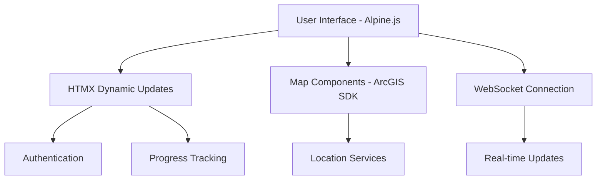
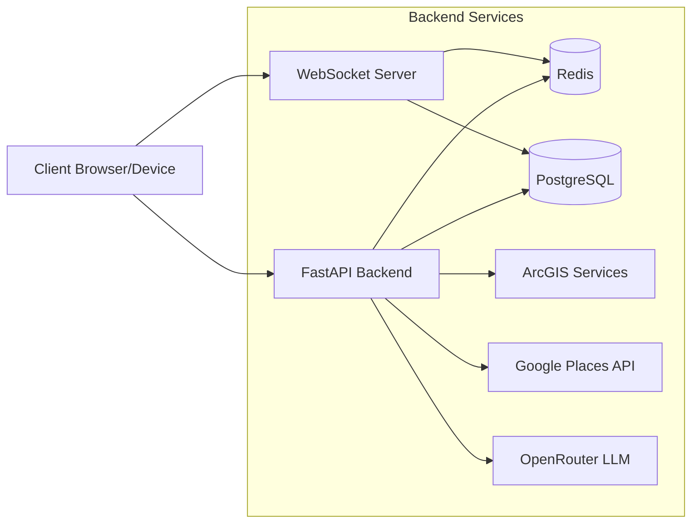
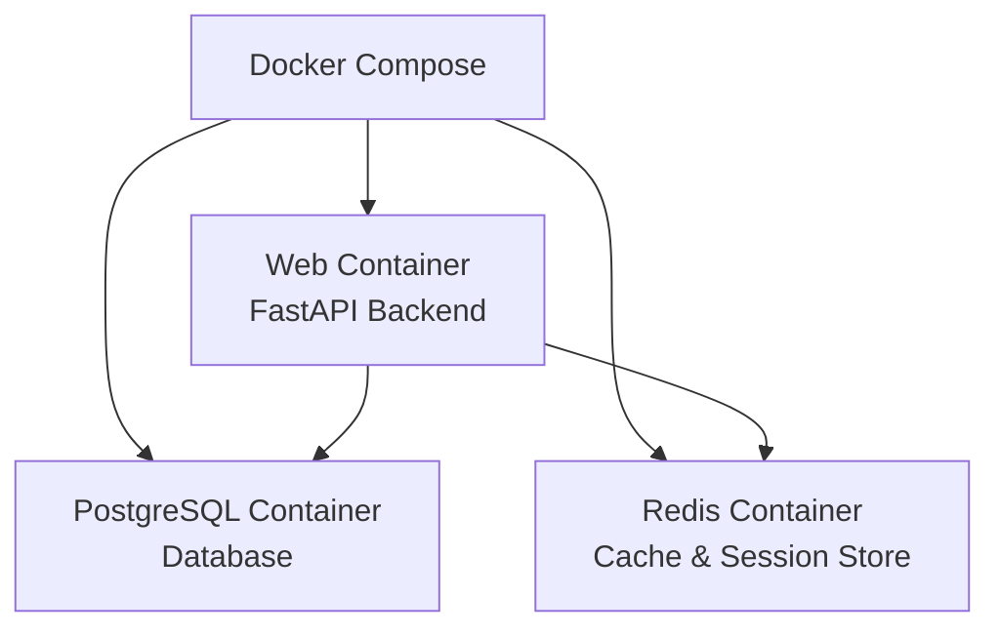
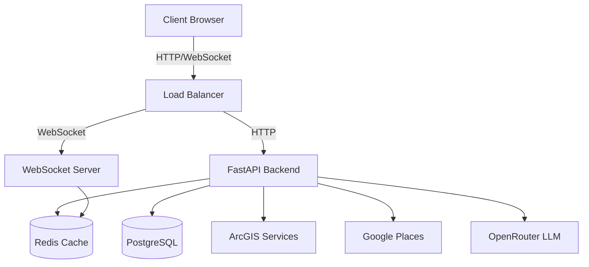
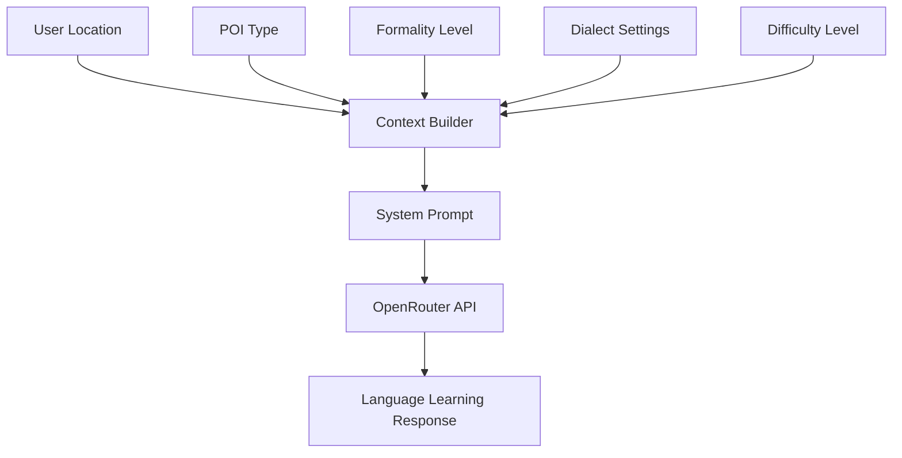

# Language Voyager Technical Documentation

## Technology Stack Overview

### Backend Technologies
- **Primary Language**: Python with FastAPI framework
- **Database**: PostgreSQL with SQLAlchemy ORM
- **Migration System**: Alembic
- **Caching**: Redis for session management and response caching
- **Real-time Communication**: WebSocket for location updates
- **Authentication**: JWT-based with OAuth2
- **Geographic Services**: 
  - ArcGIS for mapping and spatial calculations
  - Google Places API for Japanese location resolution
- **LLM Integration**: OpenRouter API for language assistance

### Frontend Technologies
- **Core UI**: Alpine.js and HTMX
- **Styling**: Tailwind CSS
- **Map Integration**: ArcGIS JavaScript SDK
- **Package Management**: npm/yarn
- **Build System**: Webpack
- **PWA Capabilities**: Service Workers for offline functionality

## Frontend Implementation

### Architecture


### Key Components
1. **Authentication System**
   - JWT token management
   - Protected route handling
   - Session persistence
   - Offline authentication support

2. **Map Integration**
   - ArcGIS JavaScript SDK integration
   - Real-time location tracking
   - POI visualization
   - Region boundary display
   - Offline map tile caching

3. **WebSocket Communication**
   - Real-time location updates
   - Connection state management
   - Automatic reconnection
   - Event handling for location changes

### Docker Configuration
- Frontend container with nginx
- Build-time optimization with webpack
- Development hot-reload support
- Static file serving
- WebSocket proxy configuration

## Backend Implementation

### System Architecture


The system architecture shows two main communication paths between the client and backend:

1. **HTTP Communication (Client → API)**
   - RESTful API requests for most operations
   - Authentication
   - Data fetching and updates
   - File uploads
   - Configuration management

2. **WebSocket Communication (Client ↔ WS)**
   - Real-time location updates
   - Live notifications
   - Status changes
   - Session management

The WebSocket Server needs access to:
- Redis (Cache) for managing session state and real-time data
- PostgreSQL (DB) for persisting real-time updates and checking permissions

Both the API and WebSocket servers share access to the same backend services to maintain consistency and enable real-time features. This architecture enables:
- Real-time updates without constant HTTP polling
- Persistent connections for live features
- Shared state between HTTP and WebSocket paths
- Consistent data access and validation

### Core Components

1. **FastAPI Application**
   - RESTful API endpoints
   - WebSocket support
   - Authentication middleware
   - Request validation
   - Error handling
   - Response caching

2. **Database Layer**
   - SQLAlchemy models
   - Alembic migrations
   - Transaction management
   - Spatial data types
   - Query optimization

3. **Caching System**
   - Redis for session storage
   - Response caching
   - Real-time location tracking
   - Rate limiting

4. **Geographic Services**
   - ArcGIS integration for mapping
   - Google Places for Japanese locations
   - Geofencing
   - POI management
   - Spatial calculations

### Alembic Migration System
Alembic is used for:
- Database schema version control
- Incremental schema changes
- Data migrations
- Schema rollbacks
- Development/production sync

Migrations are run:
1. During initial setup
2. When deploying new features
3. When updating data structures
4. For data seeding operations

### Docker Infrastructure


## API Endpoints

### Authentication Endpoints
- POST `/api/v1/auth/register` - Register new user
- POST `/api/v1/auth/token` - Login
- GET `/api/v1/auth/me` - Get current user info
- POST `/api/v1/auth/verify-email` - Verify user's email address
- POST `/api/v1/auth/request-password-reset` - Request password reset token
- POST `/api/v1/auth/reset-password` - Reset password using reset token
- GET `/api/v1/auth/validate` - Validate the current token

### Progress Tracking
- GET `/api/v1/progress/` - Get overall progress
- POST `/api/v1/progress/` - Update progress
- GET `/api/v1/progress/language/{language}` - Get language-specific progress
- GET `/api/v1/progress/region/{region_name}` - Get region-specific progress
- POST `/api/v1/progress/poi/{poi_id}/complete` - Complete POI content and check achievements

### Map and Navigation
- GET `/api/v1/map/regions` - List available regions
- GET `/api/v1/map/region/{region_id}/pois` - Get points of interest for a region
- GET `/api/v1/map/location/search` - Search for a location
- GET `/api/v1/map/route` - Get route between two points
- POST `/api/v1/map/location/update` - Update user location
- GET `/api/v1/map/geofence/check` - Check if point is within geofence
- GET `/api/v1/map/region/{region_id}/layers` - Get available map layers
- GET `/api/v1/map/pois/nearby` - Get nearby points of interest

### POI Management
- POST `/api/v1/map/pois` - Create new POI (admin only)
- PATCH `/api/v1/map/pois/{poi_id}` - Update POI (admin only)
- GET `/api/v1/map/pois/{poi_id}/content` - Get POI content
- POST `/api/v1/map/pois/{poi_id}/content` - Update POI content
- GET `/api/v1/map/pois/{poi_id}/version` - Check POI content version
- GET `/api/v1/map/pois/{poi_id}/history` - Get POI content history
- GET `/api/v1/map/pois/{poi_id}/conflicts` - List POI conflicts
- POST `/api/v1/map/pois/{poi_id}/content/draft` - Create content draft
- POST `/api/v1/map/pois/{poi_id}/resolve-conflict` - Resolve content conflicts
- POST `/api/v1/map/pois/{poi_id}/conflicts/{conflict_id}/resolve` - Resolve specific content conflict
- POST `/api/v1/map/pois/{poi_id}/rollback/{version}` - Rollback to specific content version

### Offline Support
- POST `/api/v1/map/offline/package` - Download offline package
- GET `/api/v1/map/offline/status/{region_id}` - Check offline package status
- POST `/api/v1/map/offline/sync/{region_id}` - Sync offline changes

### Region Analysis
- POST `/api/v1/map/regions/spatial-analysis` - Analyze region spatial relationships
- POST `/api/v1/map/regions/route` - Find optimal route in region
- GET `/api/v1/map/regions/{region_id}/boundary` - Get region boundary
- GET `/api/v1/map/regions/{region_id}/check-intersection` - Check point intersection
- GET `/api/v1/map/regions/{region_id}/analytics` - Get region analytics
- GET `/api/v1/map/regions/{region_id}/similar` - Find similar regions
- GET `/api/v1/map/regions/{region_id}/connectivity` - Analyze region connectivity
- GET `/api/v1/map/regions/{region_id}/clusters` - Get spatial clusters
- POST `/api/v1/map/regions/transitions` - Check region transitions
- GET `/api/v1/map/regions/nearby` - Get nearby regions

### System Management
- GET `/api/v1/map/location/config` - Get geolocation config
- POST `/api/v1/map/location/config` - Update geolocation config
- GET `/api/v1/map/arcgis/usage` - Get ArcGIS usage metrics
- GET `/api/v1/map/arcgis-usage` - Get ArcGIS usage statistics

### Conversation
- POST `/api/v1/conversation/chat` - Generate conversation response using LLM

### Basic Routes
- GET `/` - Serve index
- GET `/dashboard.html` - Serve dashboard
- GET `/health` - Health check endpoint

## API Schemas

### Understanding Schema Usage

The schemas define the JSON data structures used throughout the API in several key ways:

1. **Request Bodies**
   - Specify the required JSON structure when sending data to endpoints
   - Example: POST `/api/v1/auth/register` requires data matching the `UserCreate` schema
   - Example: POST `/api/v1/progress/` requires data matching the `ProgressUpdate` schema
   - Example: POST `/api/v1/map/pois/{poi_id}/complete` requires data matching the `POIProgressUpdate` schema

2. **Response Data**
   - Define the JSON structure of data returned from endpoints
   - Example: GET `/api/v1/auth/me` returns data matching the `UserResponse` schema
   - Example: GET `/api/v1/progress/` returns data matching the `OverallProgress` schema
   - Example: GET `/api/v1/map/pois/{poi_id}/content` returns data matching the `ContentDeliveryResponse` schema

3. **Nested Structures**
   - Some schemas are used as components within other schemas
   - Example: `Region` schema includes an array of `RegionLanguage` objects
   - Example: `ContentDeliveryResponse` schema includes a `LocalContext` object and arrays of `ContentItem` objects

4. **Common Models**
   - Shared data structures used across multiple endpoints
   - Example: `Message` schema used in chat-related endpoints
   - Example: `ConflictResolution` schema used in content conflict resolution endpoints

These schemas represent a contract between the API and its clients, ensuring consistency and proper data structure throughout all API interactions.

### Core Data Models

#### Achievement
```json
{
  "type": "object",
  "properties": {
    "id": {
      "type": "string",
      "description": "Unique achievement identifier"
    },
    "name": {
      "type": "string",
      "description": "Achievement name"
    },
    "description": {
      "type": "string",
      "description": "Achievement description"
    },
    "type": {
      "type": "string",
      "description": "Achievement type (e.g., poi_visit, content_mastery)"
    },
    "progress": {
      "type": "number",
      "minimum": 0.0,
      "maximum": 100.0,
      "description": "Progress towards achievement (0-100)"
    },
    "completed": {
      "type": "boolean",
      "default": false,
      "description": "Whether the achievement is completed"
    },
    "completed_at": {
      "type": ["string", "null"],
      "format": "date-time",
      "description": "When the achievement was completed"
    },
    "metadata": {
      "type": "object",
      "description": "Additional achievement metadata"
    }
  },
  "required": ["id", "name", "description", "type", "progress"]
}
```

#### Region
```json
{
  "type": "object",
  "properties": {
    "id": {
      "type": "string",
      "description": "Unique region identifier"
    },
    "name": {
      "type": "string",
      "description": "Region name in English"
    },
    "local_name": {
      "type": "string",
      "description": "Region name in local language"
    },
    "description": {
      "type": "string",
      "description": "Brief description of the region"
    },
    "languages": {
      "type": "array",
      "items": {
        "$ref": "#/components/schemas/RegionLanguage"
      },
      "description": "Languages available in this region"
    },
    "bounds": {
      "type": "object",
      "description": "Geographic bounds (north, south, east, west)"
    },
    "center": {
      "type": "object",
      "description": "Center point coordinates"
    },
    "difficulty_level": {
      "type": "number",
      "minimum": 0.0,
      "maximum": 100.0,
      "description": "Overall difficulty rating (0-100)"
    },
    "is_available": {
      "type": "boolean",
      "default": true,
      "description": "Whether the region is unlocked for the user"
    },
    "requirements": {
      "type": "object",
      "description": "Requirements to unlock if not available"
    },
    "total_pois": {
      "type": "integer",
      "description": "Number of points of interest"
    },
    "total_challenges": {
      "type": "integer",
      "description": "Number of available challenges"
    },
    "recommended_level": {
      "type": "number",
      "description": "Recommended proficiency level"
    }
  },
  "required": [
    "id", "name", "local_name", "description", "languages",
    "bounds", "center", "difficulty_level", "total_pois",
    "total_challenges", "recommended_level"
  ]
}
```

#### POI (Point of Interest)
```json
{
  "type": "object",
  "properties": {
    "id": {
      "type": "string",
      "description": "Unique POI identifier"
    },
    "name": {
      "type": "string",
      "description": "POI name in English"
    },
    "local_name": {
      "type": "string",
      "description": "POI name in local language"
    },
    "description": {
      "type": "string",
      "description": "Brief description in English"
    },
    "local_description": {
      "type": "string",
      "description": "Brief description in local language"
    },
    "poi_type": {
      "type": "string",
      "description": "Type of POI (e.g., restaurant, temple)"
    },
    "coordinates": {
      "$ref": "#/components/schemas/POICoordinates",
      "description": "Geographic coordinates"
    },
    "region_id": {
      "type": "string",
      "description": "ID of the region this POI belongs to"
    },
    "difficulty_level": {
      "type": "number",
      "minimum": 0.0,
      "maximum": 100.0,
      "description": "Difficulty rating (0-100)"
    },
    "content_version": {
      "type": "integer",
      "default": 1,
      "description": "Current content version"
    }
  },
  "required": [
    "id", "name", "local_name", "poi_type",
    "coordinates", "region_id", "difficulty_level"
  ]
}
```

#### ContentDeliveryResponse
```json
{
  "type": "object",
  "properties": {
    "vocabulary": {
      "type": "array",
      "items": {
        "$ref": "#/components/schemas/ContentItem"
      }
    },
    "phrases": {
      "type": "array",
      "items": {
        "$ref": "#/components/schemas/ContentItem"
      }
    },
    "dialogues": {
      "type": "array",
      "items": {
        "$ref": "#/components/schemas/ContentItem"
      }
    },
    "cultural_notes": {
      "type": "array",
      "items": {
        "$ref": "#/components/schemas/ContentItem"
      }
    },
    "difficulty_level": {
      "type": "number",
      "minimum": 0.0,
      "maximum": 100.0
    },
    "local_context": {
      "$ref": "#/components/schemas/LocalContext"
    },
    "version_info": {
      "$ref": "#/components/schemas/VersionInfo"
    }
  },
  "required": ["difficulty_level", "version_info"]
}
```

#### GeolocationConfig
```json
{
  "type": "object",
  "properties": {
    "minAccuracy": {
      "type": "number",
      "default": 20.0,
      "description": "Minimum accuracy in meters for location updates"
    },
    "maxAccuracy": {
      "type": "number",
      "default": 100.0,
      "description": "Maximum acceptable accuracy in meters"
    },
    "updateInterval": {
      "type": "number",
      "default": 5.0,
      "description": "Update interval in seconds"
    },
    "backgroundMode": {
      "type": "boolean",
      "default": false,
      "description": "Enable background location tracking"
    },
    "powerSaveMode": {
      "type": "boolean",
      "default": false,
      "description": "Reduce update frequency to save power"
    },
    "highAccuracyMode": {
      "type": "boolean",
      "default": true,
      "description": "Use GPS for higher accuracy"
    }
  }
}
```

#### ProgressUpdate
```json
{
  "type": "object",
  "properties": {
    "language": {
      "type": "string"
    },
    "region": {
      "type": "string"
    },
    "activity_type": {
      "type": "string",
      "description": "Type of activity: vocabulary, phrase, challenge, etc."
    },
    "score": {
      "type": "number",
      "minimum": 0.0,
      "maximum": 100.0,
      "description": "Score for the activity (0-100)"
    },
    "metadata": {
      "type": "object",
      "description": "Additional activity-specific data"
    }
  },
  "required": ["language", "region", "activity_type", "score"]
}
```

#### POIProgressUpdate
```json
{
  "type": "object",
  "properties": {
    "content_type": {
      "type": "string",
      "description": "Type of content interacted with"
    },
    "score": {
      "type": "number",
      "minimum": 0.0,
      "maximum": 100.0,
      "description": "Score for this interaction"
    },
    "time_spent": {
      "type": "integer",
      "minimum": 0.0,
      "description": "Time spent in seconds"
    },
    "completed_items": {
      "type": "array",
      "items": {
        "type": "string"
      },
      "description": "IDs of completed content items"
    }
  },
  "required": ["content_type", "score", "time_spent"]
}
```

#### UsageStatistics
```json
{
  "type": "object",
  "properties": {
    "daily_credits_used": {
      "type": "number"
    },
    "daily_credits_limit": {
      "type": "number"
    },
    "daily_credits_percentage": {
      "type": "number"
    },
    "monthly_operations": {
      "type": "object",
      "additionalProperties": {
        "type": "object",
        "additionalProperties": {
          "type": "number"
        }
      }
    },
    "alerts": {
      "type": "object",
      "additionalProperties": {
        "type": "object",
        "additionalProperties": {
          "type": "string"
        }
      }
    }
  },
  "required": [
    "daily_credits_used",
    "daily_credits_limit",
    "daily_credits_percentage",
    "monthly_operations",
    "alerts"
  ]
}
```

#### ConflictResolution
```json
{
  "type": "object",
  "properties": {
    "strategy": {
      "type": "string",
      "description": "Resolution strategy (accept, merge)"
    },
    "merge_strategy": {
      "type": "string",
      "description": "Merge strategy if using merge resolution"
    },
    "merged_content": {
      "type": "object",
      "description": "Manual merged content if needed"
    }
  },
  "required": ["strategy"]
}
```

#### Message
```json
{
  "type": "object",
  "properties": {
    "role": {
      "type": "string"
    },
    "content": {
      "type": "string"
    },
    "timestamp": {
      "type": "string",
      "format": "date-time"
    }
  },
  "required": ["role", "content"]
}
```

#### LocalContext
```json
{
  "type": "object",
  "properties": {
    "dialect": {
      "type": "string"
    },
    "formality_level": {
      "type": "string"
    },
    "region_specific_customs": {
      "type": "object"
    },
    "visit_count": {
      "type": "integer"
    },
    "difficulty_factors": {
      "type": "object",
      "description": "Breakdown of factors affecting content difficulty"
    },
    "difficulty_progression": {
      "type": "object",
      "description": "Projected difficulty levels for next visits"
    }
  },
  "required": [
    "dialect",
    "formality_level",
    "region_specific_customs",
    "visit_count"
  ]
}
```

#### OverallProgress
```json
{
  "type": "object",
  "properties": {
    "total_languages": {
      "type": "integer"
    },
    "total_regions": {
      "type": "integer"
    },
    "total_achievements": {
      "type": "integer"
    },
    "languages": {
      "type": "object",
      "additionalProperties": {
        "type": "number"
      }
    },
    "recent_activities": {
      "type": "array",
      "items": {
        "type": "object"
      }
    },
    "total_time_spent": {
      "type": "integer"
    }
  },
  "required": [
    "total_languages",
    "total_regions",
    "total_achievements",
    "languages",
    "recent_activities",
    "total_time_spent"
  ]
}
```

#### UserResponse
```json
{
  "type": "object",
  "properties": {
    "id": {
      "type": "integer"
    },
    "email": {
      "type": "string"
    },
    "username": {
      "type": ["string", "null"]
    },
    "is_active": {
      "type": "boolean"
    },
    "email_verified": {
      "type": "boolean",
      "default": false
    },
    "verification_token": {
      "type": ["string", "null"]
    }
  },
  "required": ["id", "email", "is_active"]
}
```

## Data Flow Architecture



The system uses a microservices-inspired architecture while maintaining the simplicity of a monolithic application. This provides:
- Clear separation of concerns
- Scalable components
- Efficient real-time updates
- Robust data persistence
- Optimized caching
- Reliable LLM integration

## LLM Integration Details

### Language Learning Context Management

The system uses OpenRouter API with context-aware prompting to create an intelligent language learning assistant. Here's how the different components work together:

1. **Location-Aware Language Teaching**


2. **System Prompt Structure**
```
You are a native {dialect} speaker helping someone learn the language. 
Current location: {current_location.get('local_name', 'Unknown Location')}
Location type: {poi_type}
Speaking style: {formality}
Difficulty level: {difficulty}/100

Guidelines:
- When asked about the current location, use the Japanese name: {current_location.get('local_name')}
- Use appropriate formality for the location type
- Stay in character as a native speaker
- Maintain conversation difficulty around {difficulty}/100
- Use {dialect} dialect features when appropriate
- Natural conversations about this location type
- Correct major language errors gently
- Provide cultural context when relevant
```

3. **Context Parameters**
   - **POI Type**: Location category (temple, station, restaurant, etc.)
   - **Formality Level**: Adjusts language politeness based on location
   - **Dialect**: Regional language variations
   - **Difficulty**: Scale of 0-100 for language complexity
   - **Location Details**: Both Japanese and romanized names
   - **Custom Rules**: Location-specific cultural notes and customs

4. **Response Characteristics**
   - Culturally aware responses
   - Gentle error correction
   - Japanese-English code switching
   - Progressive difficulty scaling
   - Natural conversation flow
   - Location-specific vocabulary
   - Cultural context integration

### System Prompt Building

The system uses a sophisticated prompt building process in `app/services/openrouter.py` through the `_build_system_prompt` method. This method constructs context-aware prompts that guide the LLM's behavior:

1. **Context Parameters**
   ```python
   def _build_system_prompt(self, context: Dict) -> str:
       poi_type = context.get("poi_type", "location")
       formality = context.get("formality_level", "neutral")
       dialect = context.get("dialect", "standard")
       difficulty = context.get("difficulty_level", 50)
       current_location = context.get("current_location", {})
   ```

2. **Base Prompt Template**
   ```text
   You are a native {dialect} speaker helping someone learn the language. 
   Current location: {current_location.get('local_name', 'Unknown Location')}
   Location type: {poi_type}
   Speaking style: {formality}
   Difficulty level: {difficulty}/100

   Guidelines:
   - When asked about the current location, use the Japanese name: {current_location.get('local_name')}
   - Use appropriate formality for the location type
   - Stay in character as a native speaker
   - Maintain conversation difficulty around {difficulty}/100
   - Use {dialect} dialect features when appropriate
   - Natural conversations about this location type
   - Correct major language errors gently
   - Provide cultural context when relevant
   ```

3. **Dynamic Custom Rules**
   - Location-specific customs are added dynamically
   - Each custom rule is formatted as "rule: description"
   - Rules are specific to the current POI type and region

4. **Validation**
The system includes comprehensive testing (in `tests/services/test_openrouter.py`) to ensure:
   - Proper formality levels
   - Correct dialect inclusion
   - Appropriate difficulty scaling
   - Custom rules integration
   - Location name handling

This prompt structure enables:
- Consistent teaching persona
- Location-appropriate language
- Progressive difficulty scaling
- Cultural context integration
- Natural conversation flow
- Gentle error correction
- Cultural awareness

### Example Interaction

Request:
```json
{
  "messages": [
    {
      "role": "user",
      "content": "Tell me about my current location"
    }
  ],
  "context": {
    "current_location": {
      "local_name": "日本、〒120-0031 東京都足立区千住大川町３６−４",
      "name": "36-4 Senju-Okawa-cho, Adachi City, Tokyo 120-0031, Japan",
      "type": "area"
    },
    "poi_type": "residential_area",
    "formality_level": "neutral",
    "dialect": "standard",
    "difficulty_level": 50
  }
}
```

Response Features:
- Location introduction in both languages
- Cultural term explanation (下町 - shitamachi)
- Gentle language correction (Hi → こんにちは)
- Progressive difficulty with new vocabulary
- Cultural and geographical context
- Natural conversation style

### Implementation Components

1. **OpenRouter Service** (`app/services/openrouter.py`)
   - API interaction management
   - Context building
   - Response generation
   - Error handling
   - Rate limiting

2. **Conversation Router** (`app/routers/conversation.py`)
   - HTTP endpoint handling
   - WebSocket support
   - Session management
   - Context validation

3. **Location Integration** (`app/services/location_manager.py`)
   - Real-time location tracking
   - POI proximity detection
   - Region awareness
   - Cultural context mapping

4. **Content Adaptation** (`app/services/recommendation.py`)
   - Dynamic difficulty adjustment
   - Content personalization
   - Learning progress tracking
   - Vocabulary management

This LLM integration creates a unique language learning experience by:
- Maintaining consistent teaching persona
- Adapting to user's location context
- Providing cultural insights
- Offering progressive language difficulty
- Supporting natural conversation flow
- Integrating location-specific learning opportunities

The system combines location awareness, cultural knowledge, and language pedagogy to create an immersive learning environment that adapts to the user's physical location and learning progress.
