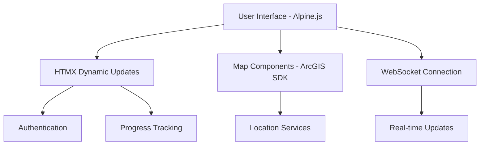
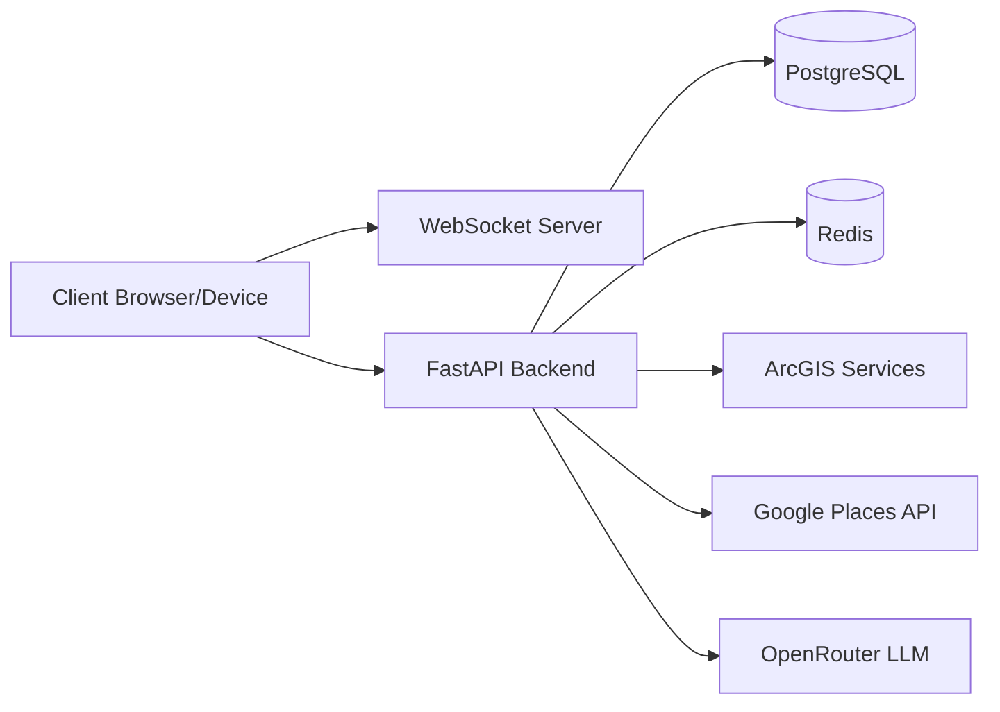
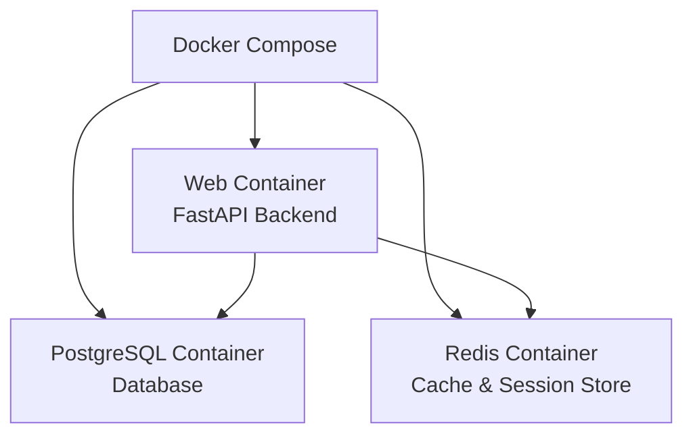
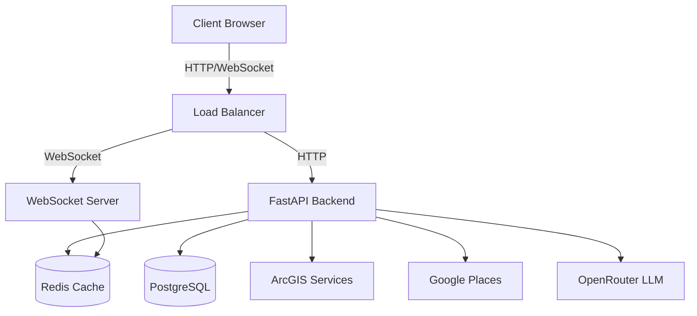

# Language Voyager Technical Documentation

## Technology Stack Overview

### Backend Technologies
- **Primary Language**: Python with FastAPI framework
- **Database**: PostgreSQL with SQLAlchemy ORM
- **Migration System**: Alembic
- **Caching**: Redis for session management and response caching
- **Real-time Communication**: WebSocket for location updates
- **Authentication**: JWT-based with OAuth2
- **Geographic Services**: 
  - ArcGIS for mapping and spatial calculations
  - Google Places API for Japanese location resolution
- **LLM Integration**: OpenRouter API for language assistance

### Frontend Technologies
- **Core UI**: Alpine.js and HTMX
- **Styling**: Tailwind CSS
- **Map Integration**: ArcGIS JavaScript SDK
- **Package Management**: npm/yarn
- **Build System**: Webpack
- **PWA Capabilities**: Service Workers for offline functionality

## Frontend Implementation

### Architecture

### Key Components
1. **Authentication System**
   - JWT token management
   - Protected route handling
   - Session persistence
   - Offline authentication support

2. **Map Integration**
   - ArcGIS JavaScript SDK integration
   - Real-time location tracking
   - POI visualization
   - Region boundary display
   - Offline map tile caching

3. **WebSocket Communication**
   - Real-time location updates
   - Connection state management
   - Automatic reconnection
   - Event handling for location changes

### Docker Configuration
- Frontend container with nginx
- Build-time optimization with webpack
- Development hot-reload support
- Static file serving
- WebSocket proxy configuration

## Backend Implementation

### System Architecture

### Core Components

1. **FastAPI Application**
   - RESTful API endpoints
   - WebSocket support
   - Authentication middleware
   - Request validation
   - Error handling
   - Response caching

2. **Database Layer**
   - SQLAlchemy models
   - Alembic migrations
   - Transaction management
   - Spatial data types
   - Query optimization

3. **Caching System**
   - Redis for session storage
   - Response caching
   - Real-time location tracking
   - Rate limiting

4. **Geographic Services**
   - ArcGIS integration for mapping
   - Google Places for Japanese locations
   - Geofencing
   - POI management
   - Spatial calculations

### Alembic Migration System
Alembic is used for:
- Database schema version control
- Incremental schema changes
- Data migrations
- Schema rollbacks
- Development/production sync

Migrations are run:
1. During initial setup
2. When deploying new features
3. When updating data structures
4. For data seeding operations

### Docker Infrastructure

## API Endpoints

### Authentication
- POST /auth/register - User registration
- POST /auth/token - Login
- GET /auth/me - Get user profile
- POST /auth/verify-email - Email verification
- POST /auth/reset-password - Password reset

### Map Integration
- GET /api/v1/map/regions - List available regions
- GET /api/v1/map/pois - Get points of interest
- GET /api/v1/map/location/details - Get location details
- WebSocket /api/v1/map/ws/location - Real-time location updates

### Progress Tracking
- GET /api/v1/progress - Get overall progress
- POST /api/v1/progress - Update progress
- GET /api/v1/progress/language/{lang} - Language-specific progress
- GET /api/v1/progress/region/{region} - Region-specific progress

### Content Management
- GET /api/v1/content/vocabulary - Get vocabulary
- GET /api/v1/content/phrases - Get phrases
- GET /api/v1/content/challenges - Get challenges
- POST /api/v1/content/challenges/{id}/attempt - Submit challenge attempt

## Data Flow Architecture

The system uses a microservices-inspired architecture while maintaining the simplicity of a monolithic application. This provides:
- Clear separation of concerns
- Scalable components
- Efficient real-time updates
- Robust data persistence
- Optimized caching
- Reliable LLM integration