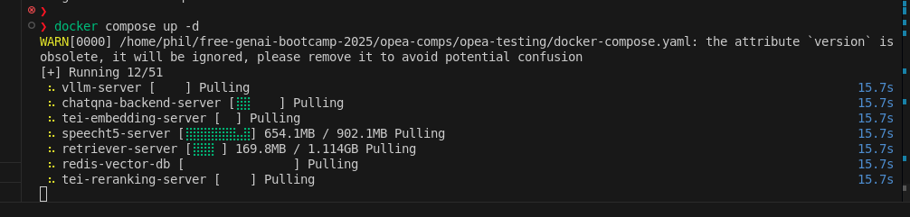
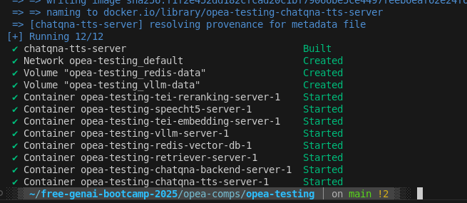
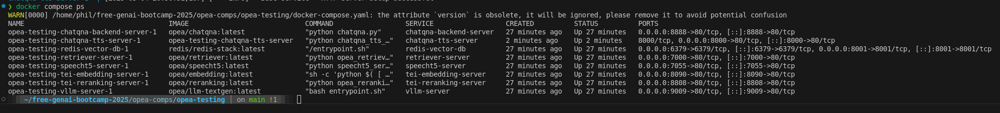

# ChatQnA+TTS Megaservice

This megaservice combines two powerful microservices:
1. **ChatQnA**: A RAG-based question answering service that processes text queries by retrieving relevant information and generating responses
2. **TTS (Text-to-Speech)**: A service that converts text to spoken audio

## Architecture

The ChatQnA+TTS Megaservice orchestrates these two microservices to create an end-to-end pipeline:
1. User submits a text query
2. ChatQnA processes the query using RAG (Retrieval-Augmented Generation)
3. TTS converts ChatQnA's text response to audio
4. User receives an audio response to their original query

## Development Setup

### Setting Up the Python Environment with UV

1. **Create a Python environment**

```bash
# Navigate to the project directory
cd /path/to/opea-comps/opea-testing

# Create a new virtual environment with UV (Python 3.10 recommended)
uv venv

# Activate the virtual environment
source .venv/bin/activate
```

2. **Install dependencies with UV**

```bash
# Install project dependencies using UV
uv pip install -r requirements.txt

# Install GenAIComps in development mode
cd ../GenAIComps-main
uv pip install -e .
cd ../opea-testing
```

3. **Optional: Install development tools**

```bash
# Install development tools
uv pip install pytest pytest-cov black flake8
```

## Quick Start

### 1. Run with Docker Compose

```bash
docker compose up -d
```

This will start all necessary services, including the underlying microservices needed by ChatQnA.

### Example Screenshots of Image Pulls, Services Starting and Running







### 2. Test the Megaservice

```bash
curl http://localhost:8000/v1/chatqna-tts \
  -X POST \
  -H "Content-Type: application/json" \
  -d '{
    "messages": "What is the revenue of Nike in 2023?",
    "max_tokens": 128,
    "voice": "default"
  }' \
  --output response.wav
```

The `voice` parameter is optional. Available options are:
- `"default"` (female voice)
- `"male"` (male voice)

The response will be a WAV file containing the spoken answer to your question.


## API Reference

### Endpoint

`POST /v1/chatqna-tts`

### Request Parameters

| Parameter | Type | Description |
|-----------|------|-------------|
| messages | string or array | The query to send to ChatQnA |
| max_tokens | integer | (Optional) Maximum number of tokens in the response |
| temperature | float | (Optional) Controls randomness of output |
| top_k | integer | (Optional) Number of top tokens to consider |
| top_p | float | (Optional) Cumulative probability threshold |
| voice | string | (Optional) Voice type: "default" or "male" |

### Response

The response is a binary audio file (WAV format) containing the spoken answer to the query.

## Deployment

The docker-compose.yaml file includes all necessary services:
- embedding-server (opea/embedding:latest): For generating embeddings
- retriever-server (opea/retriever:latest): For retrieving relevant documents
- redis-vector-db (redis/redis-stack:latest): Vector database for document storage
- reranking-server (opea/reranking:latest): For reranking retrieved results
- vllm-server (opea/llm-textgen:latest): LLM service for generating responses
- speecht5-server (opea/speecht5:latest): TTS service for converting text to speech
- chatqna-backend-server (opea/chatqna:latest): The ChatQnA megaservice
- chatqna-tts-server (custom local build): The ChatQnA+TTS megaservice

Note: The chatqna-tts-server is built locally from the Dockerfile.chatqna_tts in this repository. It orchestrates the interaction between ChatQnA and TTS services to provide an end-to-end text-to-speech question answering system.

### Docker Image Details
Most services use pre-built images from the OPEA project on Docker Hub (opea/*). However, the chatqna-tts-server is a custom service that we build locally. The build process:
1. Uses Python 3.10 slim base image
2. Installs required system packages (gcc, python3-dev, git)
3. Installs the GenAIComps package from the local repository
4. Sets up the service orchestration code (chatqna_tts_mega.py)

### Troubleshooting
Common issues and solutions:

1. **Service Connection Issues**
   - Verify that docker-compose.yaml has correct service configurations
   - Check that all required ports are available and not blocked by firewall
   - Inspect container logs for connection errors between services

2. **Audio Output Issues**
   - If response.wav is too small (< 1KB), check the service logs for errors
   - Verify that both ChatQnA and TTS services are responding correctly
   - Ensure the voice parameter is set to either "default" or "male"

3. **Docker Build Issues**
   - If building chatqna-tts-server fails, ensure you're in the correct directory
   - Verify that GenAIComps-main is available in the build context
   - Check that all required dependencies are listed in requirements.txt

## Architecture Diagram

```
┌─────────────┐         ┌──────────────────────────────────────┐         ┌─────────────┐
│  User Input │────────▶│            ChatQnA Service           │────────▶│  TTS Service│
│   (Text)    │         │                                      │         │  (SpeechT5) │
└─────────────┘         │ ┌─────────┐ ┌────────┐ ┌─────────┐   │         └──────┬──────┘
                        │ │Embedding│ │Retriever│ │Reranking│  │                │
                        │ └────┬────┘ └───┬────┘ └────┬────┘   │                │
                        │      │          │           │        │                │
                        │      └──────────┼───────────┘        │                │
                        │                 │                    │                │
                        │           ┌─────┴─────┐              │                │
                        │           │    LLM    │              │                │
                        │           └───────────┘              │                │
                        └──────────────────────────────────────┘                │
                                                                                │
                                                                        ┌───────▼──────┐
                                                                        │ User Output  │
                                                                        │   (Audio)    │
                                                                        └──────────────┘
```