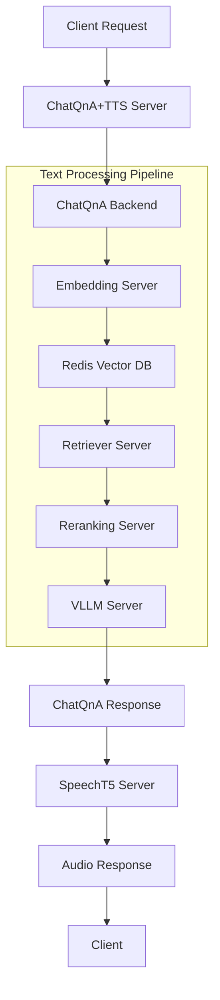

# Technical Analysis: ChatQnA+TTS Megaservice

## System Architecture Overview

The ChatQnA+TTS Megaservice is a sophisticated distributed system that combines multiple specialized microservices to deliver an end-to-end question-answering system with text-to-speech capabilities. This document provides a detailed technical analysis of the system's components, data flow, and architecture.

## Core Components

### 1. ChatQnA Backend Services

#### 1.1 Embedding Server (Port 8090)
- **Image**: `opea/embedding:latest`
- **Purpose**: Converts text inputs into high-dimensional vector representations
- **Technology**: Likely uses transformer-based models for text embedding
- **Role in Pipeline**: Entry point for text processing, creates semantic representations

#### 1.2 Retriever Server (Port 7000)
- **Image**: `opea/retriever:latest`
- **Purpose**: Performs document retrieval based on query embeddings
- **Technology**: Implements RAG (Retrieval-Augmented Generation) methodology
- **Integration**: Works with Redis Vector DB for efficient similarity search

#### 1.3 Redis Vector Database (Ports 6379, 8001)
- **Image**: `redis/redis-stack:latest`
- **Purpose**: Stores and indexes document embeddings
- **Features**:
  - Vector similarity search capabilities
  - Real-time indexing
  - Persistent storage
  - Built-in monitoring (Port 8001)

#### 1.4 Reranking Server (Port 8808)
- **Image**: `opea/reranking:latest`
- **Purpose**: Refines retrieval results for better accuracy
- **Process**: Re-scores retrieved documents based on deeper semantic analysis
- **Position**: Post-retrieval, pre-LLM processing

#### 1.5 VLLM Server (Port 9009)
- **Image**: `opea/llm-textgen:latest`
- **Purpose**: Large Language Model inference
- **Features**:
  - Text generation
  - Query understanding
  - Response synthesis
- **Integration**: Processes retrieved context to generate coherent answers

### 2. Speech Processing

#### 2.1 SpeechT5 Server (Port 7055)
- **Image**: `opea/speecht5:latest`
- **Purpose**: Text-to-Speech conversion
- **Features**:
  - Multiple voice options (default/male)
  - WAV file output
  - Real-time audio synthesis

### 3. Orchestration Layer

#### 3.1 ChatQnA Backend (Port 8888)
- **Image**: `opea/chatqna:latest`
- **Purpose**: Orchestrates the QnA pipeline
- **Responsibilities**:
  - Request routing
  - Service coordination
  - Response aggregation

#### 3.2 ChatQnA+TTS Server (Port 8000)
- **Image**: `opea-testing-chatqna-tts-server`
- **Purpose**: High-level service orchestration
- **Features**:
  - Combined QnA and TTS pipeline management
  - RESTful API endpoint
  - Request/Response handling

## Data Flow Architecture



## Request Processing Pipeline

1.  **Input Processing**
    ```mermaid
    graph LR
        User -- Submit Query --> API -- Generate Embeddings --> EmbeddingServer -- Store/Search Vectors --> VectorDB
    ```

2.  **Document Retrieval & Processing**
    ```mermaid
    graph LR
        VectorDB -- Similar Documents --> RetrieverServer -- Candidate Docs --> RerankingServer -- Ranked Documents --> LLMServer -- Generated Response --> API
    ```

3.  **Speech Synthesis**
    ```mermaid
    graph LR
        API -- Text Response --> SpeechT5Server -- WAV Audio File --> User
    ```

## API Specifications

### Main Endpoint: `/v1/chatqna-tts`
- **Method**: POST
- **Content-Type**: application/json
- **Request Parameters**:
  ```json
  {
    "messages": string | array,
    "max_tokens": integer (optional),
    "temperature": float (optional),
    "top_k": integer (optional),
    "top_p": float (optional),
    "voice": string (optional)
  }
  ```
- **Response**: WAV file (audio/wav)

## Performance Considerations

1. **Scalability**
   - Each component runs in isolated containers
   - Independent scaling possible per service
   - Redis handles vector search load

2. **Bottlenecks**
   - LLM inference time
   - Speech synthesis processing
   - Vector search with large datasets

3. **Optimization Points**
   - Redis vector index configuration
   - Batch processing capabilities
   - Cache management
   - Load balancing between services

## Security Architecture

1. **Service Isolation**
   - Container-level isolation
   - Network segmentation
   - Port exposure control

2. **Data Protection**
   - Internal service communication
   - Configurable access controls
   - Redis security features

## Monitoring and Maintenance

### Key Metrics
1. **System Health**
   - Container status
   - Service uptime
   - Resource utilization

2. **Performance Metrics**
   - Response times
   - Queue lengths
   - Processing latency
   - Memory usage

3. **Quality Metrics**
   - Retrieval accuracy
   - Speech synthesis quality
   - Error rates

## Development and Deployment

### Local Development
```bash
# Environment Setup
python -m venv .venv
source .venv/bin/activate
pip install -r requirements.txt

# Service Launch
docker compose up -d
```

### Production Deployment
- Containerized deployment
- Service orchestration via Docker Compose
- Scalable architecture
- Independent service updates

## Future Enhancements

1. **Potential Improvements**
   - Caching layer for frequent queries
   - Batch processing support
   - Additional voice options
   - Multi-language support
   - Stream processing capabilities

2. **Scalability Options**
   - Kubernetes deployment
   - Horizontal scaling
   - Load balancer integration
   - Distributed caching

## Conclusion

The ChatQnA+TTS Megaservice represents a sophisticated implementation of modern microservices architecture, combining RAG-based question answering with neural text-to-speech capabilities. Its modular design allows for flexible scaling and enhancement while maintaining robust performance and reliability.
