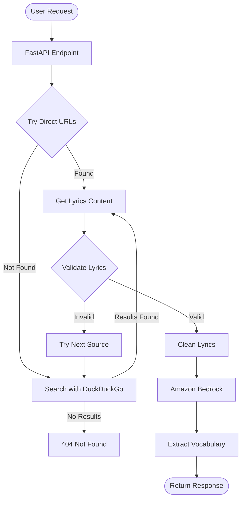
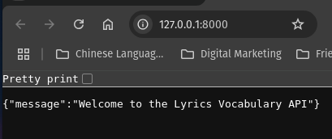
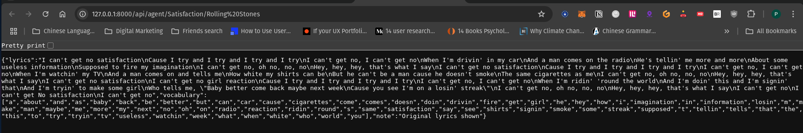
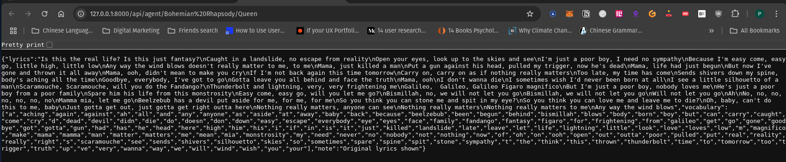

# Agentic Workflow

This project is designed to create an agentic workflow that retrieves song lyrics from various lyrics websites, processes them using Amazon Bedrock Nova Micro model, and extracts vocabulary. The application utilizes FastAPI for the web framework and implements robust lyrics validation and cleaning.

## Data Flow



## Project Structure

```
agentic-workflow
├── src
│   ├── main.py             # Entry point of the FastAPI application
│   ├── api
│   │   └── agent.py        # API endpoint for getting lyrics
│   ├── tools
│   │   ├── bedrock_client.py      # AWS Bedrock integration
│   │   ├── extract_vocabulary.py   # Functions to extract vocabulary from lyrics
│   │   ├── get_page_content.py     # Functions to retrieve webpage content
│   │   └── search_web.py          # Functions to perform web searches
│   └── models
│       └── __init__.py     # Data models or schemas for the application
├── requirements.txt         # Project dependencies
├── README.md               # Project documentation
└── config.py              # Configuration settings
```

## Prerequisites

- Python 3.8+
- AWS Account with Bedrock access (Nova Micro model)
- AWS credentials configured
- uv package manager (`pip install uv`)

## Installation

1. Clone the repository:
```bash
git clone <repository-url>
cd agentic-workflow
```

2. Create and activate a virtual environment using uv:
```bash
uv venv
source .venv/bin/activate  # On Unix/Linux
# or
.venv\Scripts\activate     # On Windows
```

3. Install dependencies:
```bash
uv pip install -r requirements.txt
```

4. Configure AWS credentials by setting environment variables:
```bash
export AWS_ACCESS_KEY_ID=<your-access-key-id>
export AWS_SECRET_ACCESS_KEY=<your-secret-access-key>
export AWS_REGION=<your-region>
```

## Usage

1. Start the FastAPI application:

```bash
uvicorn src.main:app --reload
```

Once started, you should see the API ready message:



2. Access the API through either:

   a. Browser-friendly GET request:
   ```
   http://127.0.0.1:8000/api/agent/{song}/{artist}
   ```
   Examples:
   - http://127.0.0.1:8000/api/agent/Yesterday/Beatles
   - http://127.0.0.1:8000/api/agent/Satisfaction/Rolling%20Stones
   - http://127.0.0.1:8000/api/agent/Bohemian%20Rhapsody/Queen

   Example searches and results:

   
   
   
   
   b. POST request to `/api/agent` with JSON body:
   ```json
   {
     "message_request": "Song Title by Artist Name"
   }
   ```

The response will include:
- Cleaned and formatted song lyrics
- List of unique vocabulary words extracted from the lyrics
- Optional note if lyrics are shown without Bedrock processing

Example response:
```json
{
  "lyrics": "Yesterday\nAll my troubles seemed so far away\nNow it looks as though they're here to stay\nOh, I believe in yesterday...",
  "vocabulary": ["all", "away", "believe", "far", "here", "looks", "my", "now", "oh", "seemed", "stay", "they", "though", "troubles", "yesterday"],
  "note": "Original lyrics shown"
}
```

## Features

- Web-based lyrics search using DuckDuckGo with fallback options
- Direct URL construction for popular lyrics websites (Genius, AZLyrics, Lyrics.com)
- Robust lyrics validation and cleaning
- Lyrics processing using Amazon Bedrock Nova Micro model
- Vocabulary extraction and analysis
- RESTful API with FastAPI
- Support for well-known songs with alternate titles
- Language-agnostic lyrics cleaning

## Supported Lyrics Sources

- Genius Lyrics
- AZLyrics
- Lyrics.com
- Additional sources through DuckDuckGo search

## Error Handling

The API implements various error handling mechanisms:
- 404 for lyrics not found
- 429 for rate limiting
- Automatic retries with exponential backoff
- Fallback to alternative lyrics sources
- Validation to ensure correct song/artist match

## Validation Features

- Title and artist matching
- Song-specific phrase validation
- Length and structure validation
- Metadata cleaning
- Multiple language support

## Contributing

Contributions are welcome! Please open an issue or submit a pull request for any improvements or bug fixes.

## License

This project is licensed under the MIT License.