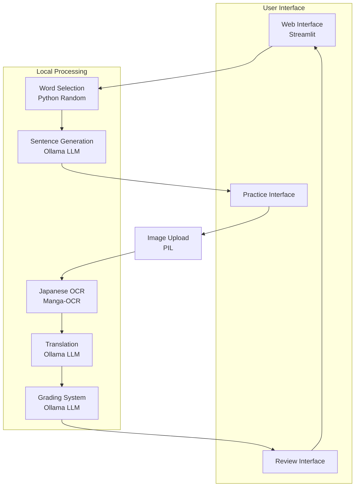

# Japanese Writing Practice App

A Streamlit-based web application for practicing Japanese writing through an interactive feedback system. The app generates English sentences, allows users to submit handwritten Japanese responses through images, and provides automated grading and feedback.

## Purpose

The Japanese Writing Practice App helps language learners practice their Japanese writing skills by:
- Generating contextual English sentences based on JLPT N5 vocabulary
- Processing handwritten Japanese submissions through image uploads
- Providing automated transcription, translation, and grading
- Offering immediate feedback and suggestions for improvement

## Design

The application follows a single-page design with three main states:
1. Setup State - Initial state with sentence generation
2. Practice State - Image upload and submission
3. Review State - Feedback and grading

### Data Flow and Technology Stack



### Technologies Used
- **Frontend**: Streamlit
- **Image Processing**: Manga-OCR, PIL
- **Language Model**: Ollama (Mistral)
- **Machine Learning**: PyTorch (CPU version)

## Requirements

### System Requirements
- Python 3.10 or higher
- Ollama installed and running locally

### Dependencies

The application relies on several Python packages to handle different aspects of the functionality:

- **Streamlit**: Web application framework that powers our user interface and handles the interactive elements
- **Manga-OCR**: Specialized OCR (Optical Character Recognition) tool designed specifically for Japanese text recognition
- **PyTorch (CPU version)**: Deep learning framework, required by Manga-OCR for text recognition
  - torch: Core PyTorch library
  - torchvision: PyTorch's computer vision library
- **Requests**: HTTP library for making API calls to the Ollama service

All dependencies can be installed using the provided `requirements.txt` file:
```sh
pip install -r requirements.txt
```

## Setup and Installation

1. Install Ollama
```sh
curl -fsSL https://ollama.com/install.sh | sh
```

2. Start Ollama service
```sh
ollama serve
```

3. Pull the Mistral model
```sh
ollama pull mistral
```

4. Create and activate a Python virtual environment (recommended)
```sh
python -m venv venv
source venv/bin/activate  # On Linux/Mac
```

5. Install required packages
```sh
pip install -r requirements.txt
```

## Running the Application

1. Ensure Ollama is running
```sh
ollama serve
```

2. Start the Streamlit application
```sh
streamlit run app.py
```

The application will be available at `http://localhost:8501` by default.

## Usage Flow

1. **Initial Setup**
   - Click "Generate Sentence" to get an English sentence

2. **Practice Mode**
   - View the generated English sentence
   - Write the Japanese translation by hand
   - Take a photo or scan of your writing
   - Upload the image
   - Click "Submit for Review"

3. **Review Mode**
   - View your transcribed Japanese text
   - See the machine translation
   - Get your grade and feedback
   - Click "Next Question" to continue practicing

## Note

This application uses local processing for all operations:
- Sentence generation uses Ollama's Mistral model
- Image transcription uses Manga-OCR
- Translation and grading use Ollama's Mistral model

No external API calls are required once the application is set up.